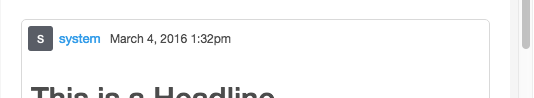
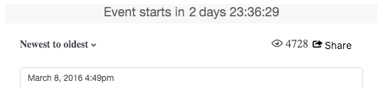
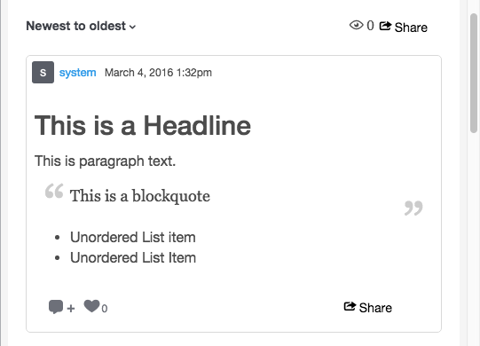
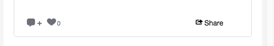

# Storify CSS类{#storify-css-classes}

可用于您的Storifify Apps的CSS类。

只需使用您自己的样式表覆盖默认CSS，使用CSS自定义您的Storifify Apps，从而与页面更全面地集成。本节介绍可用的CSS自定义。

## 作者元素 {#section_tdy_hsh_xz}

允许您自定义帖子的作者头像、作者姓名和时间戳的样式。

| 类 | 描述 |
|---|---|
| . s-author-name | 作者 |
| . s-author-avatar | 作者的头像。 |
| . s-img | 作者的头像图象。 |
| . s-timest戳 | 发布日期内容的时间戳。 |

## Header Elements {#section_nbv_gsh_xz}

允许您自定义文章页面的标题部分。

| **类** | **描述** |
|---|---|
| . super-header | 主标题 |
| . external-header | 主标题行1 |
| . s-countown | 主标题行倒计时计时器 |
| . s-lixity | 主标题行“Live”状态 |
| . base-header | 主标题行2 |
| . s-dropdown | 主标题行排序下拉触发器。 |
| . s-dropdown-menu | 主标题行排序下拉菜单。 |
| . s-dropdown-tangle | 主标题行排序下拉菜单尖角。 |
| . s-dropdown-option | 主标题行排序下拉菜单项。 |
| . s-views | 主标题行的查看次数。 |
| . s-share-button按钮 | 主标题行共享按钮。 |
| . s-share-menu | 主标题行共享菜单。 |

## 发布元素 {#section_lrs_fsh_xz}

允许您自定义帖子文章元素的样式。

| **类** | **描述** |
|---|---|
| . s-live博客 | 整个Story元素的容器 |
| . s-post | 帖子容器 |
| . s-modal-content | 发布模态容器 |
| . s-element-content | 帖子中的所有内容元素 |
| . s-element-text ul | 文本元素 |
| . s-element-text h2 | 文本元素标题 |
| . s-element-text p | 文本元素段落 |
| . s-element-text ul | 文本元素无序列表 |
| . s-element-text ol | 文本元素有序列表 |
| . s-element-text li | 文本元素列表项 |
| . s-element-text blockquote | Blockquote |
| . s-element-text blockwote：之前 | blockquote开头的图标 |
| . s-element-text blockwote：after | blockquote结束的图标 |
| . s-element-image | 内嵌图像元素容器 |
| . s-img | `` element |
| . s-image-caption | 在社交媒体上找到的图像和视频的题注(例如：Instagram图像) |
| . s-upload-image-caption | 用于通过文章编辑器上传的图像和视频的题注 |
| . s-element-video | 视频元素 |
| . s-element-quote | 报价元素(例如：仅帖子w/text) |
| . s-element-quote-image | 报价w/图像元素(例如：帖子w/image) |
| . s-element-quote-video | 报价w/video元素(例如：帖子w/video) |
| . s-link-body | 报价内部的链接预览(例如：帖子w/链接预览) |

## 页脚元素 {#section_ozc_zrh_xz}

允许您为每个帖子自定义页脚部分。

| **类** | **描述** |
|---|---|
| . s-post-footer | 帖子的页脚。 |
| . s-sist | 帖子的页脚中的“Sitenes”按钮。 |
| . s-like | 帖子的页脚中的“赞”按钮。 |
