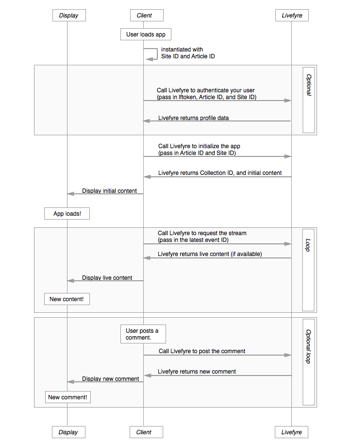

# 架构{#architecture}

学习Livefyre惯例以及Livefyre组织内容的方式。

本节概述Livefyre网络体系结构。

## 网络和站点概述

Livefyre按网络和网站组织用户和内容。每个网络可能有一个或多个与之关联的用户帐户，每个网络可能包括一个或多个Livefyre站点。Livefyre站点是集合的任意分组。一个集合映射到您的CMS中的一个文章ID。

## 理解网络 {#section_hqt_4m4_xz}

具有多个域的客户可以使用单个Livefyre网络跨所有域共享用户帐户。希望为不同域保留不同用户帐户的客户需要单独的Livefyre网络。

配置设置可应用于站点、网络和集合(在上面的插图中称为对话)。

>[!NOTE]
>
>某些设置仅在网络级别提供(例如电子邮件通知首选项、电子邮件地址和电子邮件自定义徽标)。如果您希望每个域的这些设置都不同，则必须使用多个网络。

## 了解站点 {#section_vjw_nm4_xz}

站点是文章的任意分组。分组很有用，因为它允许您将不同的版主分配给不同的内容组。主持人和所有者可以设置为审核内容，并在网络或站点级别配置管理设置。如果您希望某些版主仅查看某些集合，则这些集合可能设置为单独的Livefyre站点。

>[!NOTE]
>
>自定义网络下的站点数量没有限制。

## 应用程序序列图 {#section_mw2_lm4_xz}

无论您是希望使用Livefyre提供的端点实现自定义功能，还是只需调试某个问题，Livefyre应用程序请求/响应流的工作方式都会有所帮助。

1. 客户端点击您的站点时，使用站点ID和文章ID实例化Livefyre应用程序。
1. 如果您希望验证用户身份(用于流量评估和站点保护)，请发送Livefyre站点信息和用户配置文件令牌。
1. 发送Livefyre站点ID和文章ID以初始化应用程序。

   Livefyre返回初始内容。

   将此内容发送到页面，并显示应用程序。

1. 要更新页面上显示的内容，请从页面中向Livefyre发送最新的活动ID。如果有任何新内容可用，则将返回该内容。

   使用新内容重新加载页面，并无限重复该过程。

1. 如果允许用户发布新内容，则在站点上发布新内容时触发事件，将内容发布到Livefyre。Livefyre将返回更新的流，您可以使用该流更新站点。
