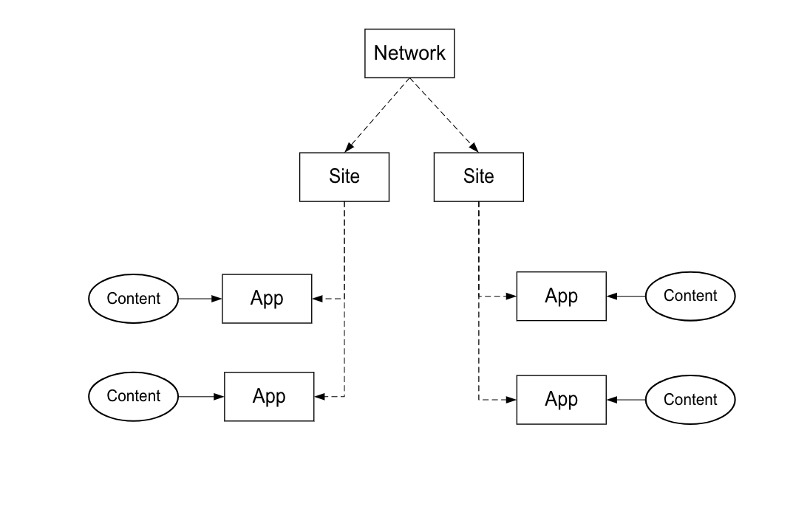

# 实施流程{#implementation-process}

实施Livefyre的时间长短取决于您的实施和工作范围。

## Livefyre网络架构概述{#section_dgj_l32_rbb}

Livefyre在讨论网络架构时使用以下术语：

* 网络. 您计划使用Livefyre的最高级域。
* 网站. 属于网络的子域或站点部分。
* 应用程序. 您网站上的内容呈现。 内容使用可视化应用程序（Mosaic、Carousel、功能卡等）以可视方式显示在应用程序中 或使用对话应用程序（评论、评论、聊天等）。 您可以在您的网站上放置一个或多个应用程序。
* 流。 流是搜索社交媒体和其他网站以自动收集内容以在应用程序中进行审核或直接发布的过滤器。
* 内容（例如，UGC、注释）。 应用程序中显示的内容。 内容可以是可视的（例如，照片或视频）、纯音频的或文本。

下图显示了网络、站点、应用程序和内容之间的关系。

您有自己的Livefyre实例，它是您管理内容、管理用户等的主要仪表板。 请联系您的CSM以获取对您的Livefyre实例的访问权限。

## 集成步骤 {#section_s2j_d2x_tz}

集成Livefyre有三个主要步骤：

* 应用程序集成

   实施Livefyre时，实施的样式取决于您的用例。 对于每个实现类型](/help/implementation/c-getting-started/c-implementation-process/c-app-integration-types.md#c_app_integration_types)的[。

* 身份验证集成

   您必须将现有用户管理系统与Livefyre集成，以便对话应用程序和需要站点上最终用户身份验证的任何其他应用程序。 如果您当前不使用用户管理工具，则可以使用Livefyre Identity。 有关[有关Livefyre Identity的更多信息、它是什么以及如何设置](/help/implementation/c-livefyre-identity-comp/c-livefyre-identity-comp.md#c_livefyre_identity)。

* 自定义

   自定义是可选的，但大多数客户都可以自定义应用程序以适合其品牌。
