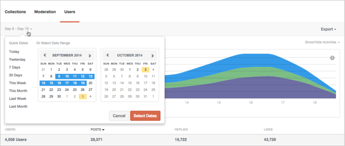
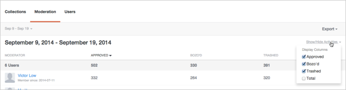
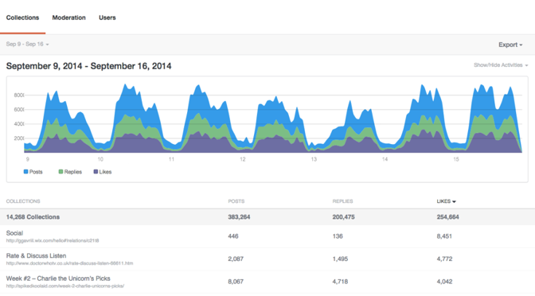
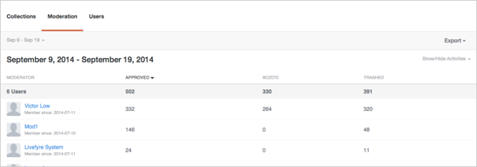
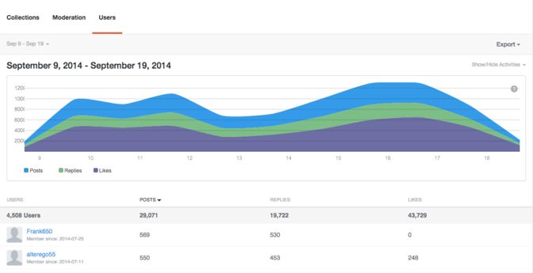

# Analytics{#analytics}

分析网站的用户、内容和审核者活动。

## Analytics {#topic_22D8FAE581CD440EA02B1595520F60C2}

分析网站的用户、内容和审核者活动。

Livefyre Analytics在功能板中提供了对网络数据的访问权，这些功能板可以轻松阅读对话、审核和用户数据。 使用这些功能板可监控活动并在您的网站上运行快速分析。

功能板可以按网站、日期和活动进行过滤。 使用窗口左上角的“网络”下拉菜单选择要显示的站点。 生成列标题后，单击该列标题可进行排序，或将鼠标悬停在图形上可了解有关任何数据点的更多特定信息。

本页介绍：

* 为功能板选择日期范围
* 显示/隐藏可用活动
* 导出功能板数据
* 收藏集功能板
* 审核功能板
* 用户功能板

>[!NOTE]
>
>Analytics当前支持源自Livefyre核心应用程序和审核的活动。 这些功能板中包含的大多数活动也可通过Livefyre JavaScript事件获取，这些事件可用于支持您自己的自定义或第三方分析工具。

## 日期范围 {#concept_798C438120E643B6BE262C9997DC87C4}

单击日期下拉列表以选择要显示的范围。 使用快速日期，或从提供的日历中选择开始和结束日期。

快速日期：

* **今天：** 显示从当天午夜到此时刻之前最后一个完整小时的数据。
* **昨天：** 显示24小时前的数据。
* **7天：** 显示过去7天的数据，不包括今天。
* **30天：** 显示前30天的数据，不包括今天。
* **本周：** 显示从上星期日的午夜到此时刻之前的最后一个完整小时的数据。
* **本月：** 显示从当月第一天午夜到此时刻之前最后一个完整小时的数据。
* **上周：** 显示上周的数据。
* **上个月：** 显示上个月的数据。

## 显示/隐藏活动 {#concept_022D9851CBCE4A2FB80D0AE52A23744D}

活动是用户在您的网站上执行的操作，包括注释、标记、共享和审核。 使用 **显示/隐藏活动** 下拉列表，选择要包含在功能板中的活动。

>[!NOTE]
>
>为过滤器选择新事件将在不更改URL的情况下重新呈现页面。

可用活动因功能板类型和导出而异，可能包括：

* **帖子：** 显示从当天午夜到此时刻之前最后一个完整小时的数据。
* **回复：** 显示24小时前的数据。
* **称赞次数：** 显示过去7天的数据，不包括今天。
* **取消称赞：** 显示前30天的数据，不包括今天。
* **包含媒体：** 显示从上星期日的午夜到此时刻之前的最后一个完整小时的数据。
* **帖子上传了照片：** 显示从当月第一天午夜到此时刻之前最后一个完整小时的数据。
* **帖子包含链接：** 显示上周的数据。
* **帖子有@mentions:** 显示上个月的数据。
* **已批准：** 显示上个月的数据。
* **博佐德：** 显示上个月的数据。
* **垃圾：** 显示上个月的数据。
* **审核总计：** 显示上个月的数据。

## 导出功能板数据 {#concept_730DB61A9F894BE6BFB34E0E2A421ED3}

使用 **导出** 下拉菜单，将功能板数据导出为CSV文件。

* 每日摘要（仅限收藏集）：导出每个收藏集的上一周的每日计数。
* 表数据：导出所有汇总的收藏集数据（当前报表中的所有列和所有行）。
* 原始数据：导出用于创建当前汇总报表的所有单个事件。

>[!NOTE]
>
>这些报表可能需要几分钟才能导出。 所有时间戳都是Unix时间。

## 收藏集 {#concept_228D8E5553784DB8BABF3819A5FF0345}

“收藏集”功能板按收藏集列出用户活动，从而允许您确定最吸引人（且最不吸引人）的内容。 列出的每个收藏集都包含一个指向可在其中找到该收藏集的页面的链接。

## 审核 {#concept_98689B1E804B43CEA21E3F456107CCD9}

“审核”功能板按审核者列出事件，以便您评估其活动。 使用此报表可查找最活跃的审核者及其最常见的审核操作。

>[!NOTE]
>
>将为审核者名称Livefyre System列出自动的Livefyre审核活动。

## 用户 {#concept_D1A83E31C7B5467F9C844CBF9A740E12}

“用户”功能板按用户显示网站活动，允许您分析各个用户与您的网站进行交互的方式。 使用此功能板可查找您网站中最活跃的用户，并评估最受欢迎的网站活动。

