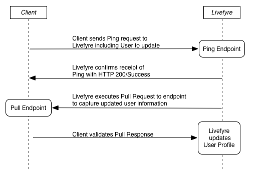

# 使用Ping for Pull{#sync-with-livefyre-using-ping-for-pull}与Livefyre同步

使用Ping for Pull使Livefyre与您的用户管理系统保持同步。

通常，您会在您的网站/应用程序的用户随时更新其用户档案（显示名称、头像等）和Livefyre ***拉取该用户的更新用户档案时，执行*** Ping ***Livefyre。***

Ping for Pull Sequence:

1. 客户向Livefyre发送Ping请求（包括要更新的用户）。
1. Livefyre确认收到Ping通过HTTP 200/成功。
1. Livefyre处理拉取请求。
1. Livefyre队列拉取请求。
1. Livefyre对端点执行拉取请求以捕获更新的用户信息。
1. 客户收到拉取响应并验证。
1. Livefyre使用“拉取”端点中包含的外部用户档案信息更新远程用户档案。

每当用户更新其用户档案信息时，Ping Livefyre。 尽管Ping for Pull完成时间可能因网络负载而异，但它将在1到10分钟内更新用户信息。 更新的用户档案更改将首先显示在Livefyre Studio >用户中。

经过两次事件后，更新的用户档案信息将显示在您的Livefyre应用程序中：

* 用户注销，然后重新登录到应用程序。 userAuthToken中的显示名称值优先于Ping for Pull更新。 用户注销/登录将刷新令牌以更新会话。

   要在更新用户档案信息时生成新的userAuthTokens，请使用SSO authDelegate在后台再次将用户注销。

* 对集合进行引导更新将导入更新的信息（最多每5-10分钟）。

要为用户用户档案系统实施Ping for Pull，请执行以下操作：

1. [构建拉式端点](#t_build_the_pull_endpoint)。

   >[!NOTE]
   >
   >Livefyre库包含同步用户方法，可让用户用户档案保持最新。 如果您使用Livefyre库，请跳过后两个步骤。

1. [在Studio中注册拉取端点](#register_the_endpoint_with_studio)。
1. [构建Ping](#t_build_the_ping)。
1. [构建Ping for Pull Response]。(#reference_n3x_pzb_mz)
