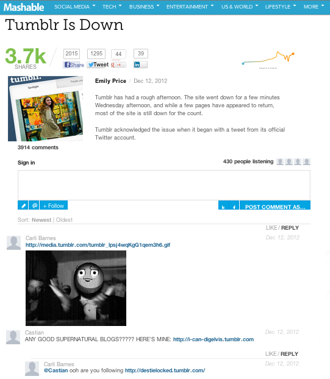

# 注释{#comments}

将实时注释嵌入应用程序。

注释通过实时对话替换默认注释。利用我们的社交集成功能，您可以轻松捕捉关于Twitter和Facebook上的帖子的所有对话，并将用户的朋友吸引到对话中。

Mashable使用评论提高用户参与讨论的参与度。包括富媒体上传、社交共享、监听器计数和单点登录有助于让对话轻松有趣的功能。

<!-- 

c_comments_app.dita

 -->

