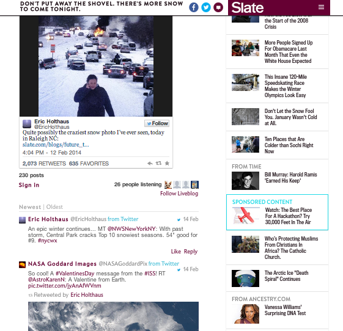

# 实时博客{#live-blog}

Live Blog使您的作者和编辑能够发布实时更新，将您的站点转变为引人入胜的实时新闻源。

团队发布的内容丰富，包括图像、视频、音频和嵌入式内容，这些内容成为新对话和线程的源头。 当为产品展示、奖励项目和体育事件部署时，Live Blog是绝佳的。

“实时博客”不同于“评论”的方式如下：

* 只有所有者和版主可以查看评论框并创建顶级帖子。
* 用户回复可能被关闭以创建仅博客作者体验。
* 用户可以从其计算机或移动设备上编写、上传照片或发布可嵌入链接。
* 注释字体更大，头像更小以强调内容。
* 如果需要，可禁用头像。

随着又一场暴风雪的到来，Slate公司希望向读者提供有关东海岸狂风天气波动的即时消息。 Slate编辑通过实时博客，可以即时共享有关这场风暴的更新，包括他们自己的照片、用户推文和有关降雪的信息。 “实时博客”非常有用，以至于它登上了Slate网站的首页。

