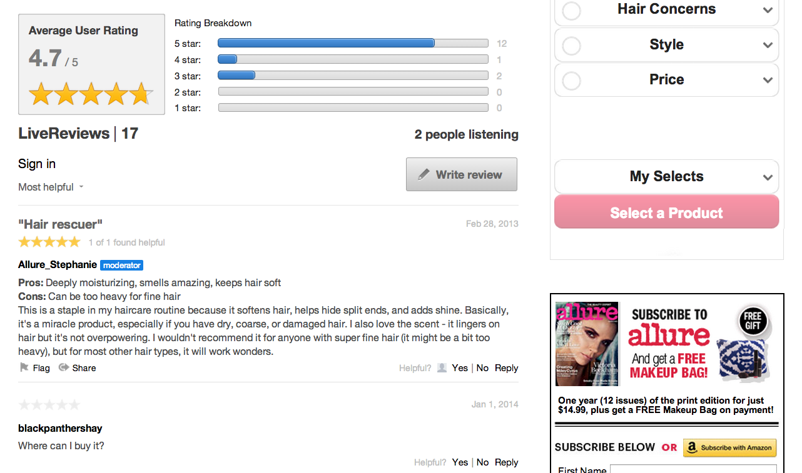

# 评论{#reviews}

对网站上的任何内容进行实时评级和查看。

用户可通过审阅轻松、实时地对产品、服务、文章或网站上的任何内容进行评级和审阅。

发布到审阅应用程序中的每个审阅都包含一行审阅标题、正文和数字评级。 评论应用程序通过包括标题和评级来量化用户的意见，并提供用户对该产品或服务的体验的摘要。

默认的审阅应用程序由审阅集合和摘要部分组成，其中显示集合的平均用户评级和评级细分。 用户可以实时阅读评论并与之交互。

Allure使用评论来邀请其用户对他们所展示的产品进行评级和观点。 通过评论，Allure能够从其受众获取宝贵的个人用户反馈。

## 评论功能{#section_awq_xph_21b}

评论优惠了特定于此应用程序的几个功能。

* 在流上方快速直观地呈现趋势（星形评级和平均评级摘要）。
* 可自定义的评级界面，包括星星数及其图像、评级子部分（如“优劣”）和多个评级类别。
* 使用审阅集合的平均用户评级和评级细分的图形可视化来汇总审阅。
* 将审阅排队以供显示，同时将用户的审阅保留在列表顶部，以供视图。
* 允许用户对评论的有益性进行投票，然后按最有用和／或最高评级进行排序。
* 适合移动设备的界面。

