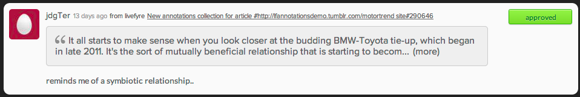

# 使用应用程序内容审核内容{#moderate-content-using-app-content}

通过库中的应用程序内容选项卡，可审核在应用程序中发布的内容。

## 审核内容 {#section_md5_sqm_zz}

使用“应用程序内容”面板来审核列出的内容，方法是更改其状态、更改其作者状态或添加备注。要审核内容，请将鼠标悬停在列出的内容上以更改可用标记，或使用 **[!UICONTROL pulldown]** 菜单更改单个或多个选定内容的状态。

在应用程序内容中，您可以：

* **[!UICONTROL Tag Content]**. 选择 **[!UICONTROL Tag Content]** 以同时向个别或多个内容部分添加标记。

* **[!UICONTROL Ignore Flags]**. 选择 **[!UICONTROL Ignore Flags]** 此选项可从标记的搜索过滤器结果中排除选定内容。选择 **[!UICONTROL Ignore Flags]** 项目不会更改其状态；它只从所有Studio用户的搜索结果中删除此搜索过滤器的搜索结果。

* **[!UICONTROL Change Content Status]**. 单击一段内容，然后使用 **[!UICONTROL Actions]** 菜单更改其状态。(使用命令或控制键选择多个项目，然后使用菜单同时更改多个内容片段的状态。)

   选项会根据所列内容的当前状态而有所不同。

   | 当前状态 | 月更改为 |
   |---|---|
   | 已批准 | 待定、垃圾桶、Bozo |
   | Bozo | 批准、待定、废纸篓 |
   | 垃圾桶 | 批准、待定、博约、删除 |
   | 待定 | 批准、废纸篓、博佐 |

* **[!UICONTROL Save as Assets]**. 选择 **[!UICONTROL Save as Assets]** 以打开“高级选项”对话框，您可以从中将选定项目保存到资产库、将其发布到应用程序或请求重复使用作者的权限。

* 根据推荐进行审核。使用 **[!UICONTROL Moderation Recommendation Indicator]** 应用程序内容过滤审核推荐确定可能被篡改的内容。

   在应用程序内容中，审核推荐如下所示： 

## 审核SiteNote内容 {#section_i2s_nqm_zz}

在内容面板中使用Sidones不同于使用其他类型的内容处理其他类型的内容：

* 不提供更多信息、回复、标记和报告以及添加备注选项卡。
* 您不能标记内容，也不能将其标记为“特色”。

它还不同于要审核的内容；它还会显示添加SitenOte时选定的文本，允许您在上下文中评估内容。

单击文本框将其展开，以包含用户所选的整个报价。

SiteNote内容审核允许批量更改，具体情况如下所述。

## 审核Livefyre用户 {#section_grw_mqm_zz}

将鼠标悬停在Livefyre用户的用户名上可打开下拉菜单，允许您访问 **[!UICONTROL Ban the User]**、获取 **[!UICONTROL More Info]**或查看其列表 **[!UICONTROL Comments]**。单击此菜单将打开Studio **[!UICONTROL Users]** 页面中的用户信息卡。

有关如何审核 **[!UICONTROL Users]** 页面用户的详细信息，请参阅 [审核用户模型](/help/using/c-features-livefyre/c-about-moderation/t-moderate-users-modq.md#t_moderate_users_modq)。
