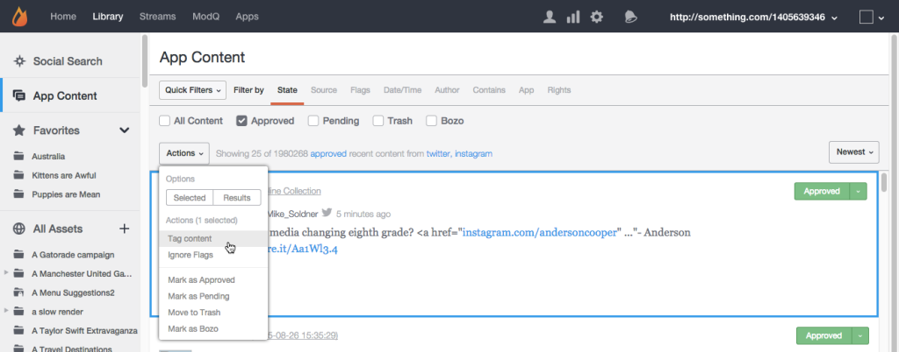

# 使用应用程序内容审核内容{#moderate-content-using-app-content}

通过库中的“应用程序内容”选项卡，您可以审核跨应用程序发布的内容。

## 审核内容{#section_md5_sqm_zz}

使用“应用程序内容”面板可以通过更改列出的内容状态、更改其作者状态或添加备注来审核列出的内容。 要审核内容，请将鼠标悬停在列出的内容上以更改可用标记，或使用&#x200B;**[!UICONTROL pulldown]**&#x200B;菜单更改单个或多个选定内容的状态。

在应用程序内容中，您可以：

* **[!UICONTROL Tag Content]**。选择&#x200B;**[!UICONTROL Tag Content]**&#x200B;可同时向单个或多个内容添加标记。

* **[!UICONTROL Ignore Flags]**。选择&#x200B;**[!UICONTROL Ignore Flags]**&#x200B;可从标记的搜索筛选器结果中排除选定内容。 为项目选择&#x200B;**[!UICONTROL Ignore Flags]**&#x200B;不会更改其状态；它只需从将来针对此搜索过滤器的搜索结果中，为所有Studio用户删除它。

* **[!UICONTROL Change Content Status]**。单击某段内容，然后使用&#x200B;**[!UICONTROL Actions]**&#x200B;菜单更改其状态。 （使用命令或控制键选择多个项目，然后使用菜单同时更改多个内容的状态。）

   选项会因所列内容的当前状态而有所不同。

   | 当前状态 | 可更改为 |
   |---|---|
   | 已批准 | 宾丁市、垃圾桶市、博佐市 |
   | 博佐 | 已批准、待处理、废纸篓 |
   | 垃圾桶 | 已批准、待定、Bozo、删除 |
   | 待定 | 批准，垃圾，博佐 |

* **[!UICONTROL Save as Assets]**。选择&#x200B;**[!UICONTROL Save as Assets]**&#x200B;以打开“高级选项”对话框，您可以从中将选定项目保存到资源库、将其发布到应用程序或向其作者请求重用权限。

* 根据建议进行审核。 使用应用程序内容中的&#x200B;**[!UICONTROL Moderation Recommendation Indicator]**&#x200B;可过滤审核推荐所标识的可能被丢弃的内容。

   在应用程序内容中，审核推荐如下所示： 

## 中级指示内容{#section_i2s_nqm_zz}

在“内容”面板中使用Siestr不同于以下几种方式使用其他类型的内容：

* “更多信息”、“回复”、“标记和报告”和“添加备注”选项卡不可用。
* 您不能标记字符表示内容，也不能将其标记为“特色”。

它的不同之处在于它不仅显示要审核的内容；它还显示添加“边框”时选择的文本，允许您在上下文中评估内容。

单击文本框以展开该框，以包含用户选择的全部报价。

如上所述，Siester允许进行批量更改和单独的状态更改。

## 审核Livefyre用户{#section_grw_mqm_zz}

将鼠标悬停在Livefyre用户的用户名上，以打开下拉菜单，允许您&#x200B;**[!UICONTROL Ban the User]**、获取&#x200B;**[!UICONTROL More Info]**&#x200B;或视图其&#x200B;**[!UICONTROL Comments]**&#x200B;的列表。 单击此菜单将打开Studio的&#x200B;**[!UICONTROL Users]**&#x200B;页面中的用户信息卡。

有关如何在&#x200B;**[!UICONTROL Users]**&#x200B;页面中审核用户的详细信息，请参阅[审核用户ModQ](/help/using/c-features-livefyre/c-about-moderation/t-moderate-users-modq.md#t_moderate_users_modq)。
