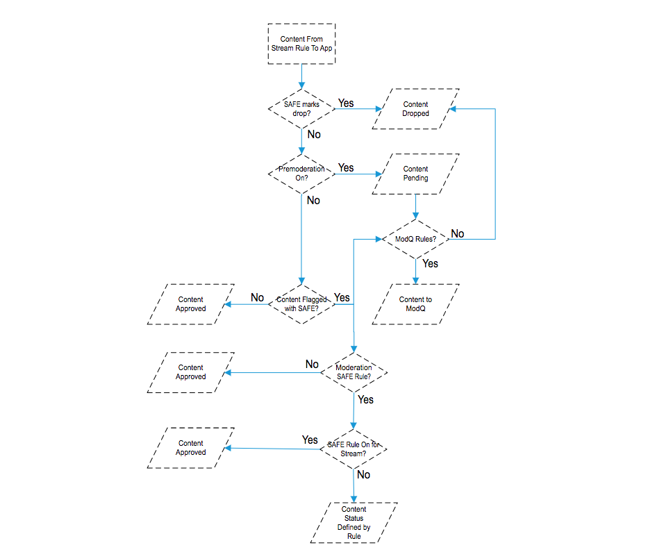
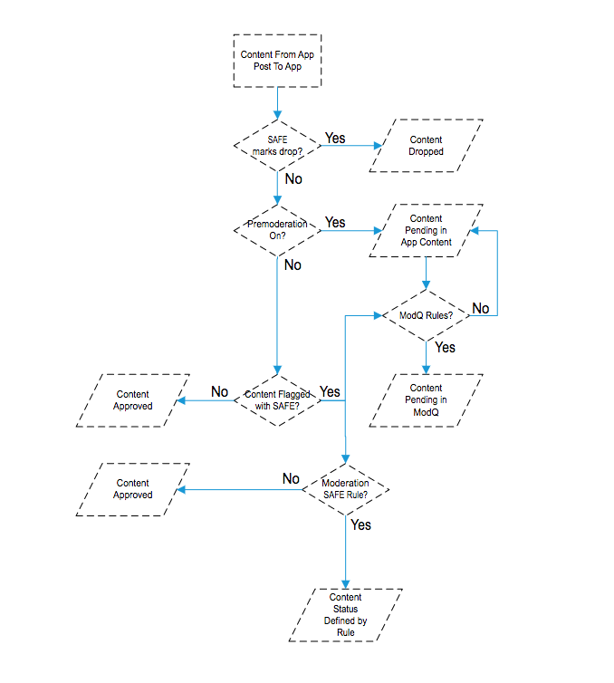
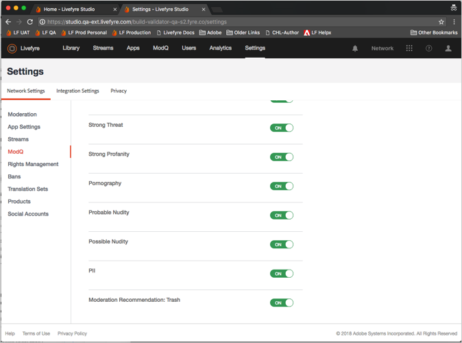
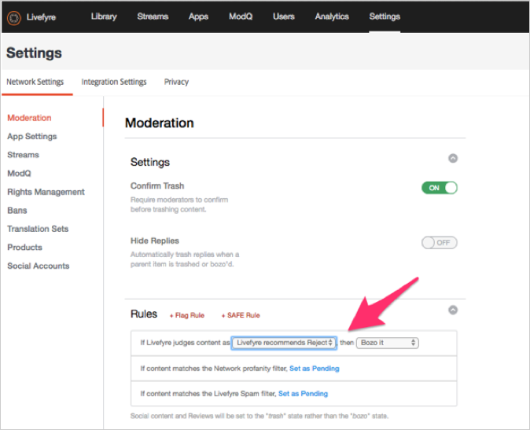
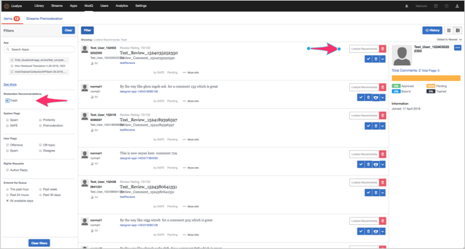
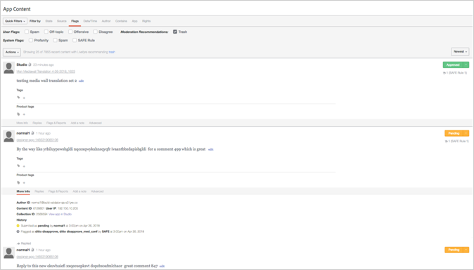

# 设置审核{#setting-up-moderation}

使用“审核”选项卡设置传入内容的审核规则，包括亵渎列表、标记规则和禁止的IP地址。

## 协调工作原理 {#section_kyf_gvc_t1b}

您可以通过以下方式审核内容：

* 自动审核内容，根据您在发布内容之前设置的规则筛选不需要的内容。
* 使用库中的Modq或App内容手动删除或批准使用自动审核标记的内容。
* 识别重复发布冒犯性内容的站点访客，以使其无法通过博客的特定Livefyre用户、社交用户或IP地址发布。
* 识别用户和内容，这些用户和内容可以通过白名单为特定的流、站点或网络关闭过滤器或关闭过滤器。

您可以通过以下方式自动审核内容：

* 设置规则以自动标记特定类型的内容：

   * 为站点访客标记标记的内容设置标记规则 **[!UICONTROL Settings > Moderation > Rules]**
   * 使用设置安全规则 **[!UICONTROL Settings > Moderation > Rules]**
   * 使用禁止的Twitter用户 **[!UICONTROL Settings > Streams]**
   * 使用禁止IP地址 **[!UICONTROL Settings > Bans]**
   * 按国家/地区代码按国家/地区代码禁止IP地区。禁止的内容将被标记为SPAM。

* 在您的网络或站点下 **[!UICONTROL Settings > Moderation > Rules]** 的“亵渎列表”中创建您认为亵渎的词语列表。
* 通过使用或关闭针对特定流、站点或网络的过滤器，白名单用户(始终允许来自这些用户的内容)显示。

设置了亵渎列表、SAFE过滤器和规则后，您可以选择是审核内容，还是在流中应用SAFE过滤器。有关详细信息，请参阅 [所有流规则的流规则选项](/help/using/c-streams/c-stream-rule-options-for-all-stream-rules.md#c_stream_rule_options_for_all_stream_rules)。

Livefyre将内容标记为 **[!UICONTROL Approved]**、 **[!UICONTROL Pending]**等 **[!UICONTROL Junk]**。根据内容的来源、内容的发布位置以及您在系统中设置的规则。下表详细介绍了Livefyre所采用的操作，具体取决于这些因素。

## 协调工作原理

| 内容来源于： | 将内容发送到： | 批准状态 |
|--- |--- |--- |
| 库 | 应用程序 | 已批准内容 |
| 社交搜索 | 应用程序 | 已批准内容 |
| 流规则 | 应用程序 | 内容是否是通过SAFE过滤器标记为Junk？  <ul><li>否-流到应用程序的审核工作流</li><li>是-内容已被窃取</li></ul> |
| 库 | 文件夹 | 无状态(在文件夹中，未发布，未被删除) |
| 社交搜索 | 文件夹 | 无状态(在文件夹中，未发布，未被删除) |
| 流规则 | 文件夹 | 内容是否是通过SAFE过滤器标记为Junk？  <ul><li>否-没有状态(在文件夹中，未发布，未被删除)</li><li>是-内容已被窃取</li></ul> |
| App Post | 应用程序 | 内容是否是通过SAFE过滤器标记为Junk？  <ul><li>否-应用程序发布后审核工作流</li><li>是-内容已被窃取</li></ul> |

## 流到应用程序协调工作流程 {#section_z5z_w4d_t1b}

在将流中的内容发布到App之前，Livefyre执行以下检查以确定内容的用途：

1. 如果SAFE将内容标记为垃圾或拖放内容，Livefyre将会毁坏内容。
1. 如果SAFE未将内容标记为垃圾邮件，Livefyre会检查是否启用了预审核。
1. 如果进行了审核，Livefyre将内容标记为待定。
1. 如果设置Modq规则，Livefyre将向Modq发送内容。
1. 如果未打开审核，Livefyre将检查SAFE是否标记了内容。
1. 如果SAFE标记了内容，Livefyre将批准内容并将内容发布到应用程序。
1. 如果SAFE标记内容，但您未设置安全规则，则Livefyre将批准内容并将内容发布到应用程序。
1. 如果SAFE标记内容并设置安全规则，Livefyre将检查您是否为流设置Safe规则。
1. 如果为流设置SAFE规则，Livefyre将批准内容并将内容发布到应用程序。如果未为流设置安全规则，Livefyre将使用协调安全规则确定如何处理内容(发送到ModQ、垃圾桶等)。

## 应用程序发布后审核工作流程 {#section_fwn_w4d_t1b}

在将应用程序帖子中的内容发布到App之前，Livefyre会执行以下检查以确定内容的用途：

1. 如果SAFE过滤器将内容标记为drop，Livefyre将丢弃内容。
1. 如果SAFE未将内容标记为drop，Livefyre将检查是否打开了预审核。如果进行了审核，Livefyre将内容标记为待定。如果设置Modq规则，Livefyre将向ModQ发送内容以等待处理。如果没有，内容将保留在库中应用程序内容中的待定状态中。
1. 如果未打开审核，Livefyre将检查SAFE是否标记了内容。否则，Livefyre将批准内容并将内容发布到应用程序。
1. 如果SAFE标记内容并设置安全规则，Livefyre将使用安全规则确定如何处理内容(发送到ModQ、垃圾桶等)。如果SAFE标记内容，但您未设置安全规则，则Livefyre将批准内容并将内容发布到应用程序。

## 批量过滤器 {#section_lyk_ktx_vy}

批量过滤器可在短时间内在所有Livefyre网络中查找发布的重复内容。如果检测到此内容，此内容将标记为“Bolk”，然后默认为垃圾。虽然批量内容可能是用户生成的(如“Touchown！”在流行的橄榄球赛期间反复发布，最受欢迎的垃圾活动。此过滤器与语言无关，并且使用任何语言。要自定义批量过滤器，您必须联系Livefyre支持。

## 规则 {#section_gqz_ksk_f1b}

根据SAFE和用户应用的标记，使用“规则”部分创建预协调规则。此面板提供两种类型的规则：

* **[!UICONTROL Flag Rules:]** 指定应对用户标记的添加次数标记的注释。
* ****[!UICONTROL SAFE Rules:]将安全标记与执行标记内容的操作相结合。

要创建旗标规则，请选择旗标(“攻击”、“关闭主题”、“反对”或“垃圾信息”)，输入应用于某一内容的次数，然后选择要采取的操作。您可以为每个旗标选项设置一个旗标规则(“攻击性”、“结束主题”、“反对”或“垃圾信息”)。

您可以在“网络”、“站点”和“流”级别创建规则。除非您以不同的方式配置站点规则，否则站点级别规则继承网络规则。除非您对站点规则进行了不同配置，否则流规则继承了站点规则。

可用的操作：

* ****[!UICONTROL Trash it:]将标记的注释发送到垃圾桶。
* **[!UICONTROL Bozo it:]** 隐藏所有用户(其作者除外)的标记注释。
* **[!UICONTROL Pending:]** 将内容设置为待定。如果您将“审核”设置为“ON”， **[!UICONTROL Settings > ModQ]**则它将位于ModQ中。否则，它仅在App Content中。

>[!NOTE]
>
>Livefyre建议您为Bozo注释创建规则，这些注释被五个用户标记为垃圾邮件或攻击。

## 协调推荐 {#section_ec3_vr3_2cb}

您可以使用协调推荐帮助您确定如何审核站点访客在Livefyre Apps中发布的内容。审核推荐指示器建议根据您之前在类似内容上采取的操作，在可能会丢弃某个内容的情况下，建议该指示符。使用审核推荐：

1. 联系Adobe Livefyre支持专业人员，打开“协调推荐”功能。
1. 在网络设置中设置协调推荐。

   使用下的 **[!UICONTROL Livefyre Recommends Trash]** 设置设置审核推荐 **[!UICONTROL Network Settings]**。

   

1. 设置一个安全规则，告诉Livefyre审核审核推荐的内容将被视为可能会被篡改的内容。有关如何设置 **[!UICONTROL Livefyre Recommends Trash]** 选项的安全规则的详细信息，请参阅 [协调](/help/using/c-features-livefyre/c-about-moderation/c-moderation.md#c_moderation)。

   

1. 使用Modq中的内容 **[!UICONTROL Moderation Recommendation Indicator]** 或应用程序内容来过滤审核推荐确定可能被篡改的内容。

   在ModQ中，指示符如下所示： 

   有关如何使用“审核推荐”在ModQ中审核内容的详细信息，请参阅 [ModQ](/help/using/c-features-livefyre/c-about-moderation/c-modq.md#c_modq)。

   在应用程序内容中，审核推荐如下所示： 

   有关如何在应用程序内容中使用审核推荐的更多信息，请参阅 [使用应用程序内容审核内容](/help/using/c-features-livefyre/c-about-moderation/c-moderate-content-using-app-content.md#c_moderate_content_using_app_content)。
