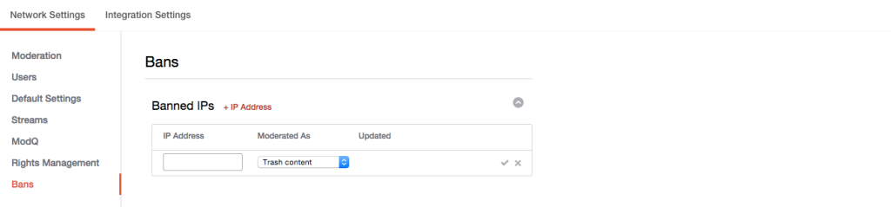

# 禁止IP地址{#ban-ip-addresses}

如果恶意用户从同一IP地址创建多个帐户，则可以禁止IP地址。

如果被禁止的用户开始意识到没有人看到他们的评论，他们可以决定使用不同的用户名和头像创建新的用户帐户，并开始发布不受禁止的新帐户的不当或垃圾邮件。审核者可以将内容识别为同一用户，并通过检查发布评论的用户的IP地址验证此假设(从“帐户详细信息”页面中)。

1. 单击 **[!UICONTROL + IP Address]** “禁止的IP”面板。
1. 在字段中输入IP地址。要禁止IP地址范围，请以“192.168.0.1-192.168.0.10”格式输入范围(将IP地址除以空格和所有引号)并单击 **[!UICONTROL Save]**。
1. 从下拉菜单(废纸篓、左色调或散点内容)中选择操作。
1. 单击要保存的复选标记。
