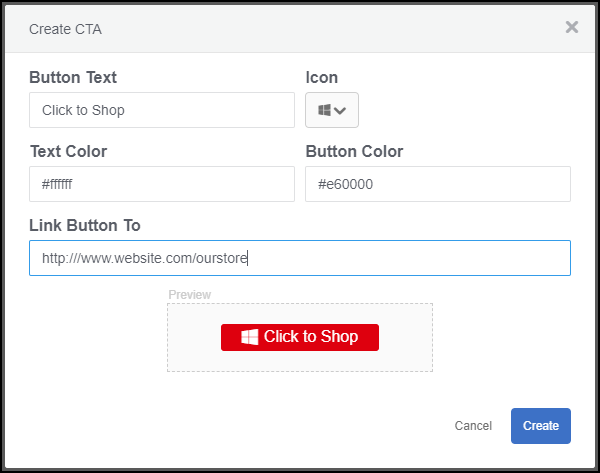
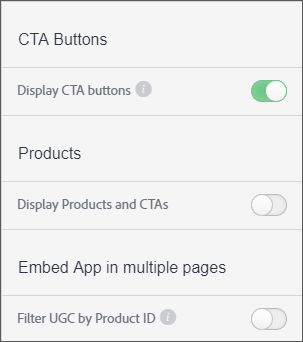

# 自定义行动动员按钮{#custom-call-to-action-button}

## 自定义行动动员按钮{#topic_EBE23A0F827645E0A0C619DCF3872EE5}

自定义行动动员(CTA)按钮是可添加到Livefyre Studio中任何资产以使内容可操作的按钮。 他们可以将最终用户引用到任何自定义的URL，如社交媒体页面或购物车。 CTA按钮可以在Livefyre中的多个位置创建，但是它们在Livefyre Studio的&#x200B;**[!UICONTROL Settings]**&#x200B;部分中进行管理。

通过自定义CTA，您可以：

* 将自定义CTA按钮添加到Livefyre媒体墙、电影、轮盘、幻灯片和各个功能卡中的任何UGC。
* 控制每条UGC上的消息、图标、颜色、链接和按钮数。
* 在“设置”和“库”中创建、管理自定义CTA按钮并重新设定其用途。
* 使用Adobe Analytics衡量点进率。

## 创建自定义行动动员按钮{#task_C61B4A8E66F24AC19C833612E596B736}

任务 Context

1. 在Livefyre Studio中，单击&#x200B;**[!UICONTROL Settings]**。
1. 在左边栏中，单击&#x200B;**[!UICONTROL CTAs]**。

   此时将显示CTA库，可在其中创建CTA并在文件夹内进行组织。 1.单击&#x200B;**[!UICONTROL Create CTA]**。
1. 使用所需的自定义项填写字段，按钮预览将在“创建CTA”屏幕底部呈现。

   

1. 单击 **[!UICONTROL Create]**.

   CTA按钮现在可添加到任何资产。

## 向资产{#task_36190DD1C8204C7793CB7EEA379C2155}添加自定义行动动员按钮

在Livefyre Studio中的任何内容中添加一个CTA按钮。

1. 在Livefyre studio中，导航到&#x200B;**[!UICONTROL Library]** > **[!UICONTROL All Assets]**。
1. 在要添加CTA按钮的一个或多个资产上进行选择。
1. 单击 **[!UICONTROL CTAs]**.

   

1. 从列表中选择所需的CTA按钮，然后单击&#x200B;**[!UICONTROL Add]**。

   此时，CTA按钮将显示在所选资产上。

   >[!NOTE]
   >
   >要使您与每个资产关联的自定义CTA显示在应用程序中，您必须在应用程序设置中启用CTA按钮：
   >
   >
