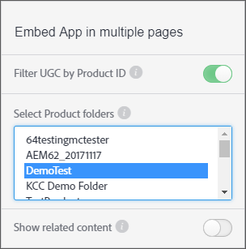

# 按产品ID {#filter-ugc-product-id}筛选UGC

通过按产品ID筛选UGC，您可以在多个页面上嵌入完全相同的应用程序，同时显示每个页面的不同产品特定UGC。

要按产品ID筛选UGC，请执行以下步骤：

1. 在Livefyre Studio中，导航到&#x200B;**[!UICONTROL Apps]**&#x200B;选项卡。

1. 选择要修改的应用程序。

1. 选择左边栏中的“设计器”选项卡。

1. 启用 **[!UICONTROL Filter UGC by Product ID]**.



1. 选择顶级产品文件夹，其中包含要筛选UGC的产品或产品。
使用CTRL/Command +单击可选择多个文件夹。

1. 禁用&#x200B;**[!UICONTROL Show related content]**。
启用后，使用`data-lf-attr-product`属性筛选的内容将首先显示，然后是应用程序中的所有其他内容。

1. 单击 **[!UICONTROL Publish]**.

1. 将要筛选的产品ID插入生成代码。

>[!NOTE]
>
>要找到产品ID，请导航到&#x200B;**[!UICONTROL Settings > Products]**。 找到所需的产品并选择它，此时会显示ID。

例如，为媒体墙应用程序生成以下代码：

```
<script type="text/javascript" src="https://cdn.livefyre.com/
Livefyre.js"></script><div class="lf-app-embed" data-lfapp="
59dc41fa-85a5-49ed-8d60-d74616b3ccd1/tagged/published" datalf-
env="prod" data-lf-read-only="" data-lf-attr-product="<product
 1>,<product 2>"></div><script>Livefyre.require(["app-embed#1.0.11"],
 function (appEmbed) {appEmbed.loadAll().done(function(embed)
 {embed = embed[0];if (embed.el.onload && embed.getConfig)
 {embed.el.onload(embed.getConfig());}});});</script>
```

要标记产品，请将`data-lf-attr-product`属性中的`<product 1>`替换为所需的产品ID。 您可以通过添加其他以逗号分隔的产品ID来标记一个或多个产品。 产品必须包含在第5步中选择的顶级产品文件夹或文件夹中。

修改后的代码段将显示为：

```
<script type="text/javascript" src="https://cdn.livefyre.com/
Livefyre.js"></script><div class="lf-app-embed" data-lfapp="
59dc41fa-85a5-49ed-8d60-d74616b3ccd1/tagged/published"
 data-lf-env="prod" data-lf-read-only="" data-lf-attrproduct="
109,47"></div><script>Livefyre.require(["app-embed#1.0.11"],
 function (appEmbed) {appEmbed.loadAll().done(function(embed)
 {embed = embed[0];if (embed.el.onload && embed.getConfig)
 {embed.el.onload(embed.getConfig());}});});</script>
```

应用程序现在将仅显示加标签的产品ID。
