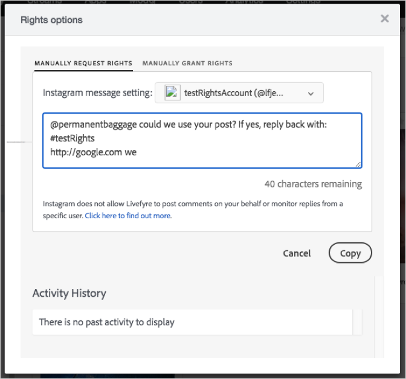

# 手动发送Instagram权限请求{#send-instagram-rights-request-manually}

您可以请求使用您从hashtag、URL或基于位置的Instagram搜索或流中获取的Instagram资产来使用手动工作流。

在发送权限请求之前，您必须：

* 添加Instagram社交帐户。有关如何配置社交帐户的详细信息，请参阅 [添加社交帐户](../c-users-creating-accounts-with-studio-access/t-configure-social-accout-instagram/t-configure-social-accout-instagram.md#t_configure_social_accout_instagram)。要发送手动或部分自动权限请求，您必须设置Instagram业务帐户。有关Instagram帐户的详细信息，请 [参阅关于Instagram帐户](../c-users-creating-accounts-with-studio-access/t-configure-social-accout-instagram/c-about-instagram-accounts.md#c_about_instagram_accounts)

* 设置Rights Management。有关如何设置权限管理的详细信息，请参阅 [请求权限](../c-how-requesting-rights-works/c-how-requesting-rights-works.md#c_how_requesting_rights_works)。

要发送Instagram内容的手动权限请求，请执行以下操作：

1. 打开 **[!UICONTROL Rights options]** 窗口。
1. 选择用于请求权限的帐户。帐户必须是Instagram业务帐户。
1. (可选)编辑请求消息。如果消息缺失某个元素或所需元素拼写错误，则会显示一条错误消息，其中指定了错误或缺失的信息。
1. 单击 **[!UICONTROL Copy]** 以将文本框中的文本复制到剪贴板。

   

   Livefyre会自动将文本从框复制到剪贴板，并显示一条消息确认您已复制了文本。

1. 单击确认消息中的链接，以打开包含您向其请求权限的资产的帖子。

   

   Livefyre将在Instagram上打开该帖子。

1. 将复制的版权请求文本粘贴到Instagram上Instagram帖子中。

手动监视权限请求：

1. 要查明用户是否响应，您必须手动监控Instagram中的帖子以获取响应。
1. 当Instagram用户授予权限时，您可以在Livefyre中手动授予内容的权限。有关如何在Livefyre中手动授予权限的信息，请参阅 [资产库中的手动授予或撤销资产权限](../c-how-requesting-rights-works/t-manually-grant-the-rights-for-one-or-more-assets.md#t_manually_grant_the_rights_for_one_or_more_assets)。

Livefyre可跟踪对资产发出手动权限请求以及授予资产权限时的跟踪。
