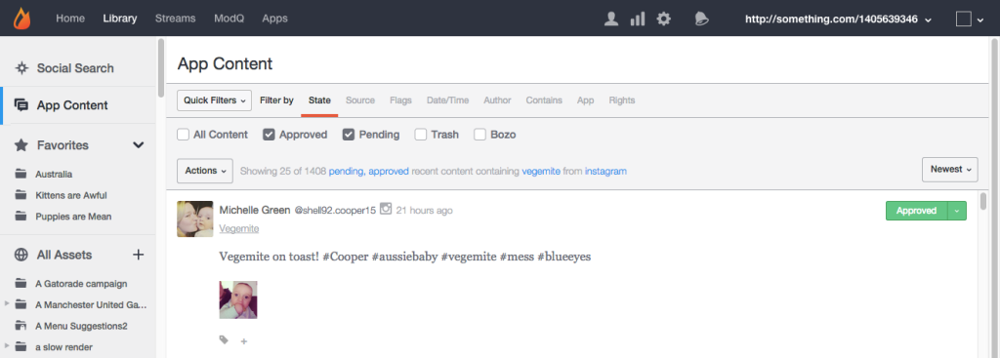
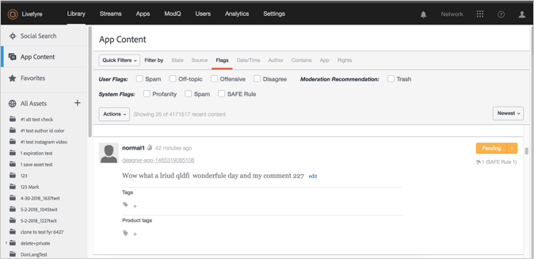
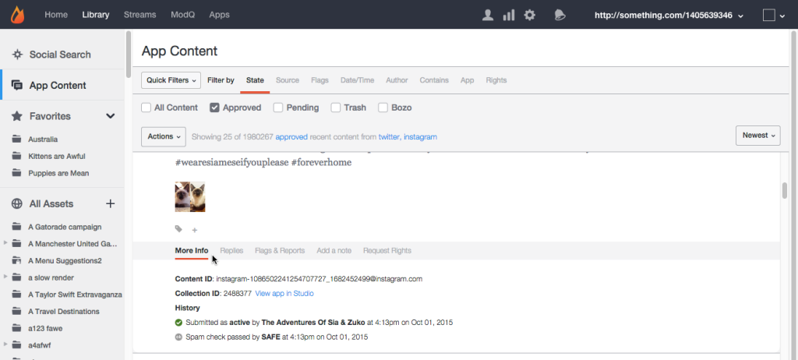
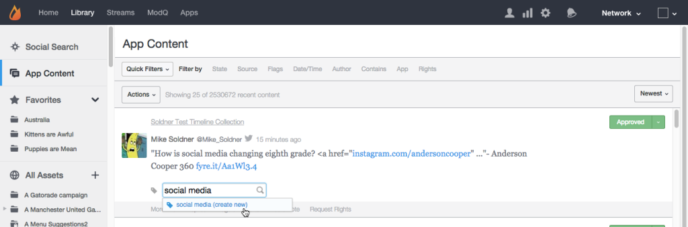

# 应用程序内容选项卡{#app-content-tab}

管理整个Livefyre网络中的内容。

通过库中的“应用程序内容”选项卡，可搜索和审核在应用程序中发布的内容。 **[!UICONTROL App Content]**&#x200B;选项卡允许使用通配符搜索的多个搜索过滤器，以便更快、更轻松地定义搜索参数。

使用“应用程序内容”选项卡可以：

* 搜索内容
* 视图内容历史
* 审核内容
* 添加标签
* 功能内容
* 将内容与产品从产品目录关联

有关如何使用“应用程序内容”选项卡审核内容的详细信息，请参阅。

## 通配符搜索{#section_jvr_ntm_zz}

Livefyre搜索字段支持通配符，通过通配符，您可以向单词（或单词片段）添加星号(*)以捕获部分匹配项。

例如：

* 球只返球
* 球*返回球和球
* *回球球
* *ball*返回球和球，滚滚球

## 搜索内容{#section_fw1_mtm_zz}

“应用程序内容”面板允许您使用多个不同的内容过滤选项缩小搜索范围。

使用&#x200B;**[!UICONTROL Quick Filters]**&#x200B;下拉变换将返回的内容缩小到&#x200B;**[!UICONTROL All Content]**、**[!UICONTROL All Sidenotes]**、**[!UICONTROL Approved]**、**[!UICONTROL Approved & Flagged]**、**[!UICONTROL Pending]**&#x200B;或&#x200B;**[!UICONTROL Rights Requests]**&#x200B;状态。 然后选择&#x200B;**[!UICONTROL Filter by]**&#x200B;选项，并使用可用的复选框或输入字段缩小搜索范围。

使用下拉菜单按&#x200B;**[!UICONTROL Newest]**、**[!UICONTROL Oldest]**、**[!UICONTROL Recently updated]**、**[!UICONTROL Most flags]**&#x200B;或&#x200B;**[!UICONTROL Most liked]**&#x200B;对列表中的内容进行排序。

## 按选项{#section_aqn_xqm_zz}过滤

使用&#x200B;**[!UICONTROL Filter by]**&#x200B;栏按以下选项进行筛选：

* **状** 态允许您按内容的当前审核状态进行筛 [!UICONTROL All Content]选：**  **[!UICONTROL Approved]***、 **[!UICONTROL Pending]**&#x200B;或 **[!UICONTROL Bozo]**。

* **源** 允许您按内容的源进行筛选。选择&#x200B;**[!UICONTROL Livefyre]**&#x200B;以列表用户生成的内容直接发布到流中。 选择&#x200B;**[!UICONTROL Facebook]**、**[!UICONTROL Twitter]**&#x200B;或&#x200B;**[!UICONTROL RSS]**&#x200B;以包括从这些源拉入您的应用程序的内容。

* **标** 志选择标志允许您按照 **[!UICONTROL User Flags]** SAFE（亵渎、垃圾信息或神奇地仲裁） **[!UICONTROL System Flags]** 应用的（垃圾信息、非主题、冒犯性或反对性）或者进行筛选 **[!UICONTROL Moderation Recommendations]**。  

* **日期/** 时间允许您根据内容的最初时间(或 **[!UICONTROL Created]** 通过SocialSync或流拖入应用程序)或最后时间(已编辑、标 **[!UICONTROL Modified]** 记或状态已更改)进行筛选。

* **作** 者允许您按作者的地址、 **[!UICONTROL IP]** ( **[!UICONTROL Display Name]** 在“用户”面板上或作者发布的内容的上方)或(在“用 **[!UICONTROL User ID]**&#x200B;户”面板上)进行筛选。

* **包** 含允许您按或筛选最近90天的 **[!UICONTROL Keyword]** 内容 **[!UICONTROL Content Tag]**。选中&#x200B;**[!UICONTROL Media]**&#x200B;复选框可仅返回包含媒体的内容。 (要搜索所有内容，请向下滚动浏览列表中的所有内容，然后单击&#x200B;**[!UICONTROL Search full data]**。)

   **注意：** 不支持多关键字和内容标记搜索。如果输入了多个关键字或标记，则将使用最后一个词进行搜索。

   按内容标记搜索时，当您在搜索字段中键入时，将自动填充建议的标记。 搜索结果将返回所有已分配标记的内容。 （使用此字段搜索特色内容，或单击Studio中任何特色内容的&#x200B;**[!UICONTROL Featured]**&#x200B;标签。）

   **注意：** 在标记名称前使用减号(-)符号可搜索不包含该标记的内容。例如：搜索“ — Miley”以搜索不包含“Miley”标记的所有内容。

* **** App允许您按、 **[!UICONTROL Collection ID]**&#x200B;或 **[!UICONTROL App Tag]**&#x200B;父 **ID筛选**。按父项ID过滤会返回所有作为对输入内容ID的回复的内容。 （通过输入以逗号分隔的标记，按多个标记过滤。）

* **权** 限允许您按“权限请求”状态进行筛 [!UICONTROL Requested]选：**  **[!UICONTROL Granted]**、 **[!UICONTROL Replied]**&#x200B;或 **[!UICONTROL Expired]**。

## Bozo内容{#section_afl_vqm_zz}

在“应用程序”中，**[!UICONTROL Bozo]**&#x200B;内容仅向内容作者显示。 这样，用户就可以相信其内容已被批准，同时将其隐藏给所有其他用户和版主。

>[!NOTE]
>
>使用SocialSync或流&#x200B;**[!UICONTROL cannot]**&#x200B;生成的社交内容设置为Bozo。

您可以Bozo内容，原因如下：

* SAFE标识为垃圾邮件的内容将自动设置为Bozo状态。
* 来自“禁用用户”的所有内容将自动设置为Bozo。
* 内容可以标记为Studio中的Bozo。
* 版主可以直接在流中Bozo内容。

## 视图内容历史记录{#section_ayz_tqm_zz}

“内容”面板允许您审阅所有列出内容的历史记录，包括预审、垃圾邮件过滤、帖子日期以及分配给该项目的任何用户标志或备注。

使用内容面板底部的选项卡视图其历史记录。

* **[!UICONTROL More Info:]** 列表此内容上的所有活动，包括提交、编辑、垃圾邮件检查、状态更改和备注。本节中还显示Livefyre内容ID和用户的IP地址。
* **[!UICONTROL Replies:]** 列表最多6个回复。单击&#x200B;**[!UICONTROL Show all replies]**&#x200B;以显示对帖子的所有回复。

* **[!UICONTROL Flags & Reports:]** 列表所有用户标志，以及标记内容的用户的头像和任何报告（用户标记内容时添加的注释）。
* **[!UICONTROL Add a note:]** 允许您添加注释，其他管理员或管理者可以看到该注释。
* **[!UICONTROL Request Rights:]** 打开对 **[!UICONTROL New Rights Request]** 话框，从中可以发出权限请求。

* **[!UICONTROL Save as Asset:]***打开&#x200B;**[!UICONTROL Advanced Options]**&#x200B;对话框，通过该对话框可将选定项目保存到资源库、将其发布到应用程序或向其作者请求重用权限。

## 向内容{#section_xb4_mxr_rdb}添加标记

标记内容使您能够对内容进行分类和组织，以便轻松进行检索和样式自定义，或将内容标记为特色。

要添加标记，只需单击内容下的加号(**[!UICONTROL +]**)图标。 输入新标记，或从现有标记的列表中进行选择。

## 在所有资产{#section_zxf_hsf_wcb}中搜索图像

将内容添加到库后，即可按智能标签搜索内容。

在库中的“所有资源”下，您可以通过单击&#x200B;**[!UICONTROL Show Filters]**&#x200B;搜索现有图像，然后：

* 在搜索字段中输入要搜索的文本
* 按相关性排序
* 在&#x200B;**[!UICONTROL Tags]**&#x200B;字段中输入文本以按智能标记进行搜索。 “智能标签”排名算法使用智能标签置信度得分过滤器内容，内容的新增内容以及用户为内容提供的星号。

## 特色内容{#section_emb_kqm_zz}

选择默认&#x200B;**[!UICONTROL Featured]**&#x200B;标记，将内容标记为特色，并突出显示它对您的用户同样重要。 标记后，使用自定义样式选项自定义应用程序中的特色内容。

## 要对内容{#section_ojx_3qm_zz}进行功能设置或取消功能设置

* 在Studio中，单击某条内容旁边的&#x200B;**[!UICONTROL +]**&#x200B;符号，在下拉列表中选择&#x200B;**[!UICONTROL Featured]**&#x200B;标签，然后单击&#x200B;**[!UICONTROL Enter]**&#x200B;以显示功能内容。 标记将保存并显示在内容的旁边。

* 要取消功能，请单击内容片段上显示的&#x200B;**[!UICONTROL Featured]**&#x200B;标签上的&#x200B;**[!UICONTROL x]**。

* 从“注释”、“实时博客”或“评论”应用程序中，将指针悬停在要显示的内容上，然后单击&#x200B;**[!UICONTROL Feature]**。 要取消功能，只需将鼠标悬停在内容上，然后单击&#x200B;**[!UICONTROL Unfeature]**。

>[!NOTE]
>
>由于空间限制，聊天内容可能仅使用Studio进行特色介绍或不使用Studio进行特色介绍，并且可能不会从应用程序本身进行特色介绍。

## 编辑特色内容{#section_pyw_hqm_zz}

对内容采取的大多数常规操作都可用于特色内容，但以下情况除外：

* 无法标记特色内容。
* 用户在内容功能完成后无法编辑其内容，不过，如果他们愿意，仍可以删除它。 版主可以编辑特色内容。
