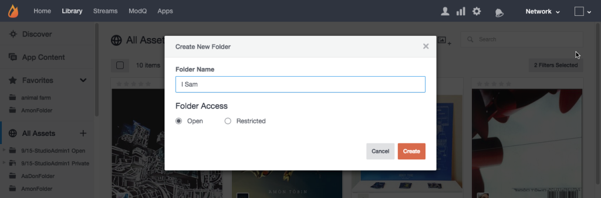

# 创建资产文件夹{#create-asset-folders}

创建文件夹以组织资产。

创建新文件夹后，将按字母顺序将其添加到“所有资产”列表。 要添加子文件夹，请首先选择该子文件夹所在的文件夹，然后单 **[!UICONTROL Create New Subfolder]** 击页面顶部的图标。

1. 从树 **[!UICONTROL Create new folder]** 视图中单击，输入名称，然后单击 **[!UICONTROL Create]** 以在所有资产的顶级创建文件夹。
1. 选择一个文件夹，然后单击 **[!UICONTROL Create New Subfolder]** 页面顶部的图标以添加子文件夹。
1. 从对话框向资源库添加内容时，创建新文 **[!UICONTROL Add to folder > Select folder]** 件夹。
