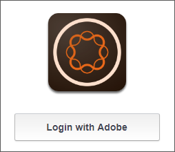
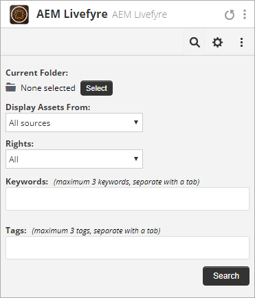
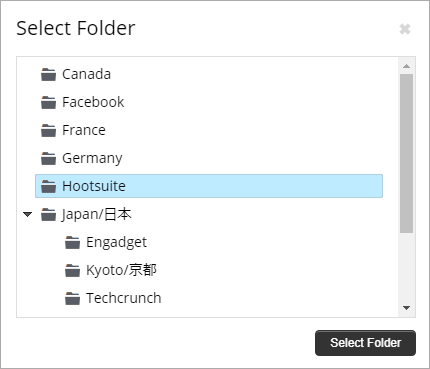
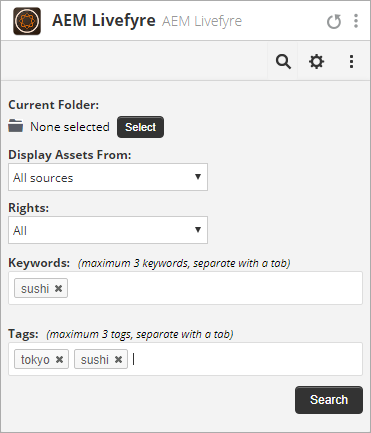
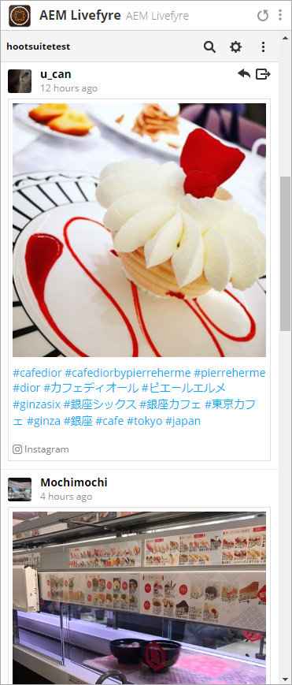
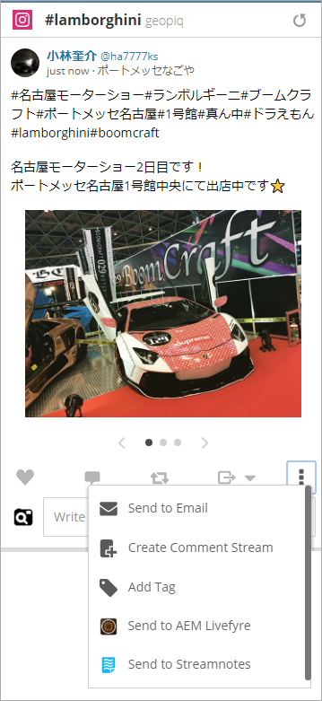
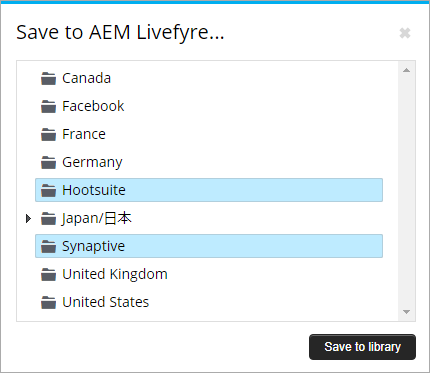
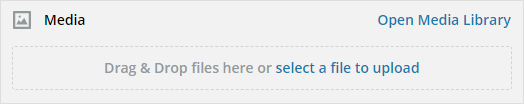
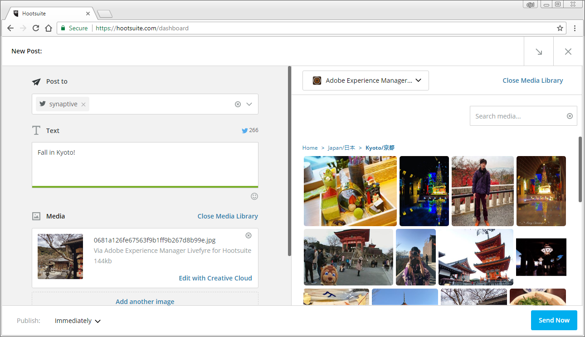

# 将Adobe Experience Manager Livefyre与Hootsuite{#use-adobe-experience-manager-livefyre-with-hootsuite}一起使用

了解如何将Experience Manager Livefyre与Hootsuite结合使用，使您能够直接从Hootsuite仪表板管理、管理和共享用户生成的内容。

## 将Adobe Experience Manager Livefyre与Hootsuite {#topic_FB6E613DBCF74F39ABD5045C501EA326}一起使用

了解如何将Experience Manager Livefyre与Hootsuite结合使用，使您能够直接从Hootsuite仪表板管理、管理和共享用户生成的内容。

## 快速入门 {#task_22699BD901C24384AB2DC02D926D8F4A}

任务 Context

1. 从Hootsuite应用程序目录安装Adobe Experience Manager Livefyre for Hootsuite。

1. 在您的Hootsuite仪表板中，单击&#x200B;**使用Adobe**&#x200B;登录。

   

1. 使用您的Livefyre凭据登录Experience Manager Livefyre。
1. 单击&#x200B;**授权**&#x200B;授予Hootsuite访问库的权限。

   

   授予权限后，您将返回Hootsuite仪表板，在该位置可搜索Experience Manager Livefyre库中的资源。

## 搜索资产 {#task_0B011B0C539E400BB72A6DF69FBF66C0}

任务 Context

1. 单击菜单栏中的搜索图标，以搜索您的Experience Manager Livefyre库中的资源。

   

1. 单击&#x200B;**选择**，将显示一个弹出窗口，其中显示了您的所有库。
1. 单击库的文件夹，然后单击&#x200B;**选择文件夹**&#x200B;以选择将在Hootsuite流中显示的库。

   

## 筛选选项 {#concept_5D062A9CD61A4B2E90784E5AA31CB16D}

您可以使用显示资产自、权限、关键字和标记部分来筛选搜索结果。

筛选选项包括：

| 区域 | 描述 |
|--- |--- |
| 显示资产来源 | 选择以从所有源或单个源视图资产。 例如：Instagram、Twitter、Facebook等。 |
| 权利 | 选择此选项可仅视图具有特定权限设置的资产。 |
| 关键字 | 选择以按关键字或标记筛选结果。 按关键字筛选将搜索帖子的文本内容以及作者显示名称和作者用户名。 |
| 标记 | 选择以按关键字或标记筛选结果。 按关键字筛选将搜索帖子的文本内容以及作者显示名称和作者用户名。 |

在您选择了搜索参数后，您的资产将在您搜索时以流形式显示：

### 流菜单选项

单击用户名或图标将显示相应网络上的用户。 单击时间将显示原始文章。 当鼠标移过项目时，将显示更多选项。 单击共享

图标会将当前资产添加到网络合成框，允许您通过Hootsuite将其与网络共享。

>[!NOTE]
>
>只有在筛选具有已授予权限的资产时，才会显示共享按钮。

单击“分配”图标，将当前项目分配给您的Hootsuite团队成员之一。 如果已分配项目，则解析

图标。 单击它可解析当前分配。

### 其他应用程序菜单

单击设置

图标将允许您断开当前Experience Manager Livefyre帐户的连接，并与另一个帐户连接。

单击菜单

图标将显示此文档、支持和Synaptive网站的链接。

## Experience Manager Livefyre App Plugin {#task_33C8CEF4F5E44830B970BB3A7AAA2AA6}

除了能够在Hootsuite流中显示资源库外，您还可以将来自Instagram、Twitter、Facebook和YouTube流的项目保存到Experience Manager Livefyre库。

1. 单击每个项目底部的“菜单”图标。

   

1. 选择&#x200B;**发送到AEM Livefyre**。
1. 选择一个或多个库以将资源保存到。

   

1. 单击&#x200B;**保存到库**，项目将保存到所选库。

## Experience Manager Livefyre Media Library组件{#task_9CA2D5D49F8E463F9EF475BC09C8ACC9}

您可以通过Hootsuite Composer的媒体组件访问您的资产。

1. 在Composer中，单击&#x200B;**Media**&#x200B;部分中的&#x200B;**打开Media Library**&#x200B;链接。

   

1. 从下拉菜单中选择Adobe Experience Manager Livefyre，您的文件将会显示。

   

1. 要将资产添加到您正在写入的当前帖子，请单击该资产。 要搜索特定资产，请在&#x200B;**搜索媒体**&#x200B;框中输入搜索词，此时将显示结果。
