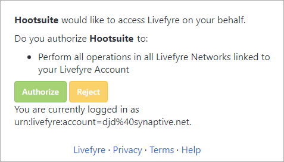

# 使用Adobe Experience Manager Livefyre与HootSuite{#use-adobe-experience-manager-livefyre-with-hootsuite}

了解如何使用Experience Manager Livefyre与Hootsuite一起使用，您可以直接从HootSuite仪表板管理、管理和分享用户生成的内容。

## 使用Adobe Experience Manager Livefyre与HootSuite {#topic_FB6E613DBCF74F39ABD5045C501EA326}

了解如何使用Experience Manager Livefyre与Hootsuite一起使用，您可以直接从HootSuite仪表板管理、管理和分享用户生成的内容。

## 入门指南 {#task_22699BD901C24384AB2DC02D926D8F4A}

任务上下文

1. 从HootSuite App Directory安装Adobe Experience Manager Livefyre for HootSuite。

1. 在您的HootSuite仪表板中，单击 **“通过Adobe登录**”。

   

1. 使用Livefyre凭据登录Experience Manager Livefyre。
1. 单击 **“授权** ”以授予HootSuite访问库的权限。

   

   授予许可后，您将返回到Hootsuite仪表板，在该面板中可搜索Experience Manager Livefyre库中的资产。

## 搜索资产 {#task_0B011B0C539E400BB72A6DF69FBF66C0}

任务上下文

1. 单击菜单栏中的搜索图标可在Experience Manager Livefyre库中搜索资产。

   

1. 单击 **“选择”** ，此时将向所有库显示一个弹出窗口。
1. 单击库的文件夹，然后单击 **选择文件夹** 以选择将显示在HoootSuite流中的库。

   

## 过滤选项 {#concept_5D062A9CD61A4B2E90784E5AA31CB16D}

您可以使用“显示资产”、“权限”、“关键字”和“标记”部分过滤搜索结果。

筛选选项包括：

| 章节 | 描述 |
|--- |--- |
| 显示资产来源 | 选择从所有源或单个源查看资产。例如：Instagram、Twitter、Facebook等 |
| Rights | 选择此选项可仅查看具有特定权限设置的资产。 |
| 关键字 | 选择以按关键字或标记过滤结果。按关键字筛选将搜索帖子的文本内容以及作者显示名称和作者用户名。 |
| 标记 | 选择以按关键字或标记过滤结果。按关键字筛选将搜索帖子的文本内容以及作者显示名称和作者用户名。 |

选择搜索参数后，搜索时将在流中显示资产：

### 流菜单选项

单击用户的姓名或图标将在各个网络上显示用户。单击时间将显示原始文章。当鼠标停留在物品上时，将显示更多选项。单击共享 

图标会将当前资源添加到网络合成框，允许您通过HoootSuite与网络共享它。

>[!NOTE]
>
>只有在筛选具有授予权限的资产时，共享按钮才会显示。

单击“分配  ”图标，将当前项目分配给某个HootSuite团队成员。如果已分配项目，则解决 

图标将显示。单击它以解决当前任务分配。

### 其他应用程序菜单

单击设置 

图标将允许您断开当前Experience Manager Livefyre帐户的连接，并与其他用户联系。

单击菜单 

图标将显示此文档、支持和Synaptics网站的链接。

## Experience Manager Livefyre App插件 {#task_33C8CEF4F5E44830B970BB3A7AAA2AA6}

除了能够在HootSuite流中显示资源库之外，您还可以将物品从Instagram、Twitter、Facebook和YouTube流保存到Experience Manager Livefyre库中。

1. 单击每个项目底部的菜单图标。

   

1. 选择 **“发送到AEM Livefyre**”。
1. 选择一个或多个库以保存资产。

   

1. 单击 **保存到库**，项目将保存到您选择的库中。

## Experience Manager Livefyre媒体库组件 {#task_9CA2D5D49F8E463F9EF475BC09C8ACC9}

您可以通过HootSuite Composer的媒体组件访问您的资产。

1. 在Composer中，单击“媒体”部分中 **的“打开媒体库****** ”链接。

   

1. 从下拉菜单中选择Adobe Experience Manager Livefyre，此时将显示您的文件。

   

1. 要向您所编写的当前帖子添加资产，请单击该资产。要搜索特定资产，请在 **“搜索媒体”** 框中输入搜索词，并将显示结果。
