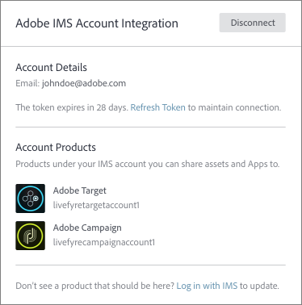
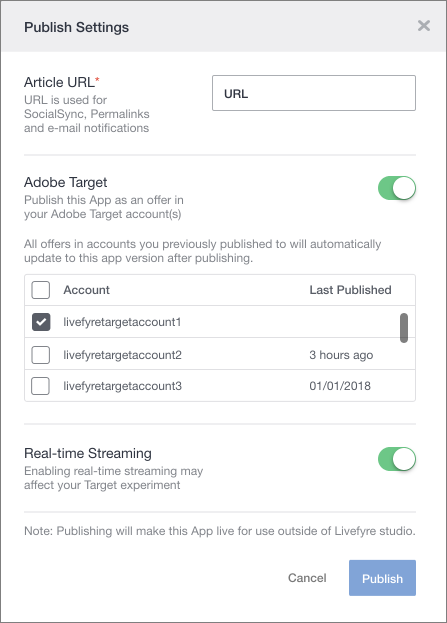

# 将Adobe Experience ManagerLivefyre与Adobe Target一起使用{#livefyre-target}

Livefyre与Adobe Target的集成允许您直接将Livefyre应用程序共享到目标优惠库。

## 使用目标{#connect-livefyre-target}连接Livefyre实例

通过在用户设置中链接您的AdobeIMS帐户，将Livefyre实例与Adobe Target连接。

1. 在Livefyre Studio中，单击&#x200B;**[!UICONTROL Users]**&#x200B;选项卡。

1. 选择要通过IMS帐户集成连接到目标的用户帐户。

1. 单击 **[!UICONTROL Connect]**.

1. 输入您的IMS凭据。

您的AdobeIMS帐户有权在AdobeIMS集成窗口中显示的产品实例。

您的Livefyre实例现已连接到Adobe Target。

## 与Adobe Target共享Livefyre应用程序{#share-livefyre-target}

直接与Adobe Target共享在Livefyre Studio中创建的应用程序。

1. 在Livefyre Studio中，单击&#x200B;**[!UICONTROL Apps]**&#x200B;选项卡。

1. 选择要共享给Adobe Target的应用程序。

1. 单击 **[!UICONTROL Publish]**.

1. 在“发布设置”中，单击“Adobe Target”开关。

出现列表目标实例。

1. 选择要在其中共享应用程序的目标实例。

1. 单击  **[!UICONTROL Publish]**.

Livefyre应用程序现在可用于您的目标优惠库。 有关发布应用程序的详细信息，请参阅目标文档中的[发布内容](/help/using/c-library/t-publish-content.md)和[优惠](https://docs.adobe.com/content/help/en/target/using/experiences/offers/manage-content.html)。