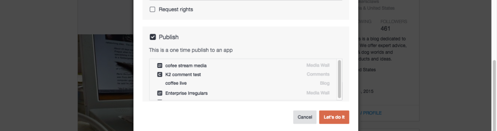

# 发布内容{#publish-content}

将内容直接发布到应用程序。

直接发布到应用程序的内容将不会保存在您的资产库中。

1. **[!UICONTROL View Details]** 。
1. 从&#x200B;**[!UICONTROL Advanced Options]**&#x200B;对话框中选中&#x200B;**[!UICONTROL Publish]**&#x200B;复选框。
1. 选择应将项目发布到的应用程序。
1. 单击 **[!UICONTROL Let’s do it]**.
