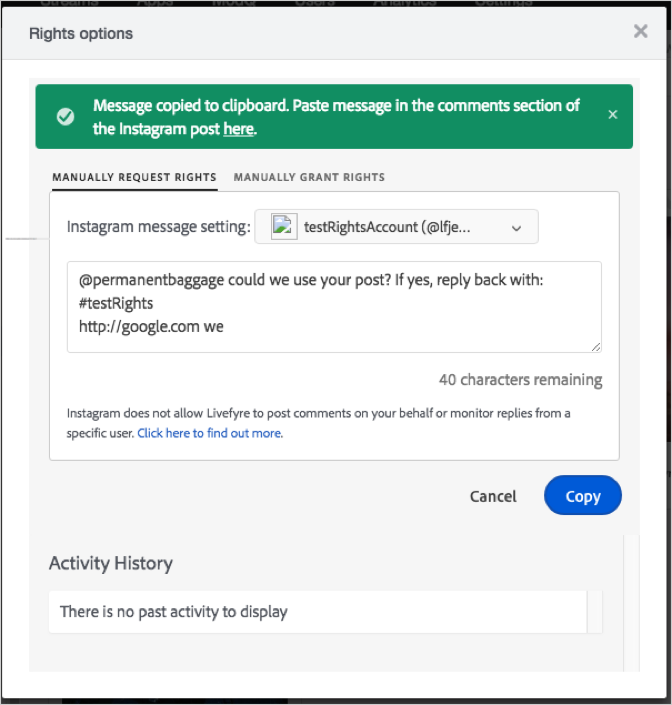

# May 24, 2018{#may}

2018年5月24日版本的发行说明。

## 新增功能

**Instagram权限请求，更新第1部分。**

由于Instagram API发生更改，无法从Livefyre在Instagram中发送权限请求。 Livefyre为用户创建了手动解决方法来发送权限请求。 使用此方法手动发送权限请求的功能在应用程序内容、库中可用，但ModQ中不可用（将在将来的版本中提供）:

1. 打开您从Instagram帖子获取的资产。
1. 打开“权限请求”对话框。

   此时将显示包含权限请求文本的对话框。

1. 单击复制按钮，将框中的文本复制到剪贴板。

   

   Livefyre会自动将文本框复制到剪贴板，并显示一条消息，确认您已复制文本。

1. 单击确认消息中的链接以打开包含您请求权限的资产的帖子。

   

   Livefyre在Instagram中打开帖子。

1. 将复制的权限请求文本粘贴到Instagram上的Instagram帖子中。
1. 监视帖子以进行响应。
1. 如果Instagram用户授予权限，您可以在Livefyre中手动授予权限。

>[!NOTE]
>
>在2018年6月14日之前，将推出更无缝的解决方法（第2部分）。 有关详细信息，请参 [阅公告](/help/using/c-anouncements.md#c_anouncements)。

## 问题

此版本中解决了下表中的问题。

## 生产版本

| **问题类型** | **组件** | **发行说明** |
|---|---|---|
| 错误 | Studio | 修复了对Facebook API的更新导致某些媒体显示错误的问题。 |

## UAT版本

此版本没有UAT发行说明。
