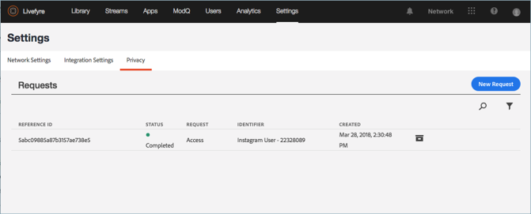
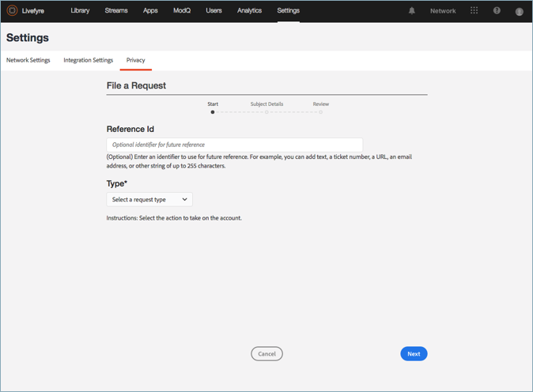
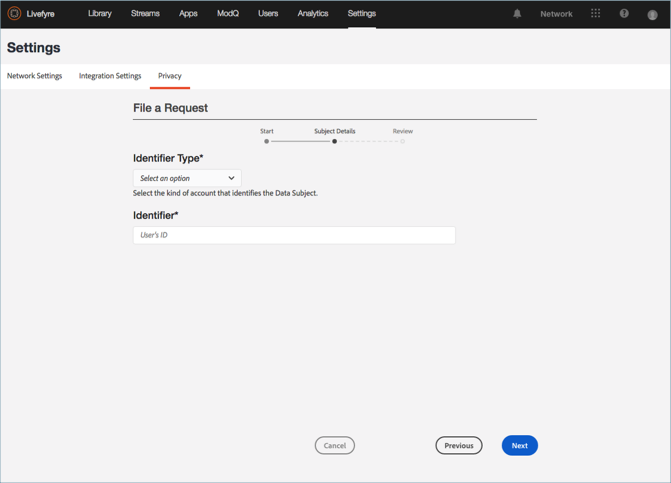
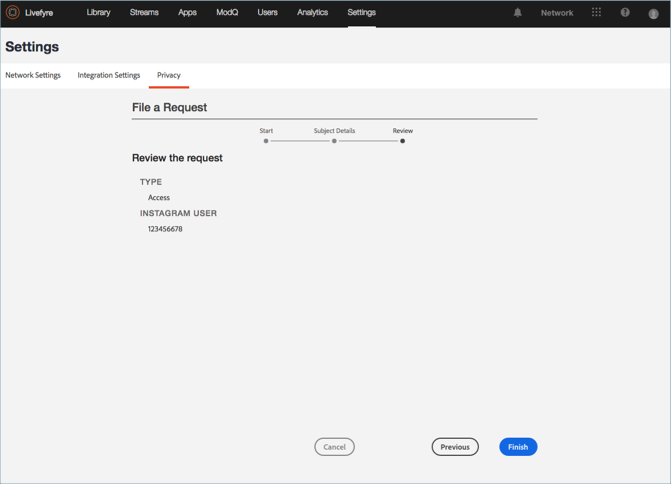

# 创建隐私请求{#create-a-privacy-request}

在Livefyre中创建隐私请求。

删除用户的所有数据，为用户生成报告的报告，并使用此过程选择加入或选择退出。

要搜索并查找用户并生成其内容报告，请执行以下操作：

1. 转至， **[!UICONTROL Settings > Privacy]**然后单击 **[!UICONTROL Create Request]**。

   

1. 填写 **[!UICONTROL Submit Request]** 窗口中的信息：

   * **[!UICONTROL Reference Id]**. 输入用于将来引用的标识符。例如，您可以添加文本、票证编号、URL、电子邮件地址或最多255个字符的字符串
   * **[!UICONTROL Type]**

      * **访问**。收集与帐户关联的所有可用数据。敏感详细信息(例如密码或社交凭据)将被模糊化或忽略。

      * **删除**。删除或模糊与帐户关联的所有数据。**如果选择此选项并单击“提交”，则无法撤消或取消此操作， *也无法恢复已删除的数据。*** 如果帐户属于Livefyre Studio用户，则会保留一些数据以保持业务记录的完整性。

         >[!IMPORTANT]
         >
         >删除帐户的数据将永久删除或销毁与帐户关联的数据。您不能撤消此操作，也不能在删除数据后恢复数据。

      * **选择退出**。防止Livefyre通过“流”或“社交搜索”从社交帐户被动收集数据或内容。选择加入和退出不适用于注册用户
      * ****选择加入。重新使Livefyre能够被动收集之前通过流或社交搜索选择退出的社交帐户中的数据或内容。选择加入和退出不适用于注册用户
      

   * **[!UICONTROL Identifier Type]** 并且 **[!UICONTROL Identifier]**

      * **[!UICONTROL User Account]**

         * 根据用户管理系统或Livefyre的Studio用户标识符生成的用户帐户ID标识注册用户的帐户。您还可以在 **Livefyre****用户设置中的用户详细信息中找到用户帐户ID，** 或者在 **资产库** 或 **应用程序内容中的内容的详细信息中找到用户帐户ID。**

         * 允许的值：Alpha数字字符串最多255个字符。电子邮件地址不是有效的输入
      * **[!UICONTROL Facebook User]**

         * 由Facebook提供的数字ID标识帐户。申请人应提供此信息。您可以在此处找到如何在此处找到数字Facebook ID [的说明。](https://www.facebook.com/help/1397933243846983?helpref=faq_content)
         * 允许的值：6-16数字字符
      * **[!UICONTROL Instagram User]**

         * 由Instagram提供的数字ID标识帐户。申请人应提供此信息。您可以通过在线搜索找到有关如何在Instagram帐户上找到数字Instagram ID的说明。
         * 允许的值：5-16数字字符
      * **[!UICONTROL Twitter User]**

         * 通过Twitter提供的数字ID标识帐户。请求隐私权更改的人应提供此类更改。您可以通过在线搜索找到有关如何找到Twitter帐户的数字Twitter ID的说明。
         * 允许的值：5-16数字字符
      * **[!UICONTROL YouTube User]**

         * 由YouTube提供的数字ID标识帐户。请求隐私权更改的人应提供此类更改。您可以在此处找到关于如何在YouTube帐户 [上找到数字YouTube ID的说明。](https://support.google.com/youtube/answer/3250431?hl=en)
         * 允许的值：5-16数字字符
      * **[!UICONTROL Generic Author]**

         * 通过Livefyre作者ID(JID)标识帐户。对于通过RSS、Tumblr或URL生成的内容，请使用此选项。要查找此ID，请搜索 **属于应用程序内容** 或 **资产库中作者的内容**，然后选择一个项目。ID在“信息”部分的 **“信息”** 下 **** 或“详细信息 **”** 部分 **中的“作者** ” **下** 可用。

         * 允许的值：Alpha数字字符串最多255个字符
         

1. 单击 **[!UICONTROL Finish]**。

   

1. (仅限删除请求)确认要删除用户的所有信息。

   >[!IMPORTANT]
   >
   >删除帐户的数据将永久删除或销毁与帐户关联的数据。您不能撤消此操作，也不能在删除数据后恢复数据。

