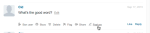

# 本地化字符串{#localize-strings}

自定义Livefyre应用程序的字符串。

任何Livefyre应用程序中的大多数HTML元素的文本字符串都可以进行自定义。这样可以灵活地将呈现的HTML元素的文本更改为任何有效的UTF-8字符串，如“帖子为”按钮、“注释计数”文本或“登录”按钮。使用此功能可为您的流添加个性化，或为用户基础本地化应用程序中的语言。

* 评论、聊天和实时博客

   * [实施](#c-localize-strings/section_im4_224_xz)
   * [帐户访问](#c-localize-strings/section_cm3_d24_xz)
   * [流信息](#c-localize-strings/section_wx1_c24_xz)
   * [流排序](#c-localize-strings/section_ih2_124_xz)
   * [内容信息](#c-localize-strings/section_llv_yd4_xz)
   * [特色内容](#c-localize-strings/section_gmw_vd4_xz)
   * [文本编辑器](#c-localize-strings/section_ky5_td4_xz)
   * [响应选项](#c-localize-strings/section_zvt_qd4_xz)
   * [注释通知程序](#c-localize-strings/section_qqt_pd4_xz)
   * [错误消息](#c-localize-strings/section_omz_jxn_xz)

* [时间和日期格式](#c-localize-strings/section_yz4_g5n_xz)
* [媒体墙](#c-localize-strings/section_vwt_d5n_xz)
* [地图](#c-localize-strings/section_fxv_c5n_xz)
* [Mosaic](#c-localize-strings/section_e2s_b5n_xz)
* [Carousel](#c-localize-strings/section_l2z_hkn_xz)
* [功能卡](#c-localize-strings/section_mw2_hkn_xz)
* [投票](#c-localize-strings/section_pdg_fwh_xz)
* [Livefyre Identity](#c-localize-strings/section_zc3_xvh_xz)
* 更多:
   * [审阅文本字符串](/help/using/c-settings-other/c-translation-sets/c-review-text-strings.md#c_review_text_strings)
   * [Siten表示](/help/using/c-settings-other/c-translation-sets/c-sidenotes-text-strings.md#c_sidenotes_text_strings)

## 实施 {#section_im4_224_xz}

要执行此功能，请传递要覆盖到JavaScript配置对象的字符串的一个-1对象映射。如果不提供字段，则将使用默认文本。

示例：

```
var customStrings = {     
   postAsButton: "New Post As Text",     
   postEditButton: "New Post Edit Text"  
};   
   convConfig["strings"] = customStrings; fyre.conv.load(     
   networkConfig,     
   [convConfig],     
   function(){}  
);
```

此页面列出了可能为Livefyre核心应用程序自定义的所有文本字符串。

## 帐户访问 {#section_cm3_d24_xz}

可用于身份验证过程的字符串以及经过身份验证的用户菜单。


| Element | Key | 默认文本 |
|---|---|---|
|  | displayName | %s |
|  | 编辑配置文件 | 编辑配置文件 |
|  | NotificationSettings | 通知设置 |
|  | SiteAdmin | Admin Console(链接到Studio) |
|  | SignOut | 注销 |

## 流信息 {#section_wx1_c24_xz}

可用于内容流信息和显示的字符串。列出侦听人数、应用程序的帖子数，并允许用户登录或访问他们的帐户信息。

| Key | 默认文本 | 流数据 |
|---|---|---|
|  | CommentCountLabelZero | %s评论 |
|  | commentCountLabel | %s评论 |
|  | CommentCountLabelMultiple | %s评论 |
|  | listenerCount | 人物监听 |
|  | listenerCountMultiple | 用户聆听 |
|  | LivePointPostCountLaberZero | post |
|  | LivePointPostCountLabel | post |
|  | LivePointPostCountLaberMultiple | post |
| 线程选项 | DetailDeoutButton | 显示整个线程 |
|  | toggleCollapse | 切换折叠 |
| 高速/排队的注释 | 刷新 | 刷新 |
|  | NewComment | 新评论 |
|  | News Comments | 新评论 |
|  | 新增回复 | 新回复 |
|  | NewReads | 新回复 |

## 流排序 {#section_ih2_124_xz}

允许按年龄或受欢迎程度对返回的内容进行排序。


| Key | 默认文本 | 标题选项 |
|---|---|---|
|  | SortNewest | Newest |
|  | Sortolest | 旧版 |
|  | SortTopComments | 热门评论 |
|  | SorthotHels | 热门线程 |
|  | SortSeparator |  |  |
|  | 流式排序 | 加载 |
|  | topCommentContentNotFoundMsg | 还没有足够的喜欢。 |
|  | hotNetworsContentNotFoundMsg | 还没有足够的线程。 |
|  | Streamrefresh | 了解新增功能。 |
| 页脚选项 | ArchiveHeaderTitle | 从存档 |
|  | 存档更多 | 显示更多 |
|  | Showmore | 显示更多注释 |
|  | showMoreLiveBlog | 显示更多帖子 |


## 内容信息 {#section_llv_yd4_xz}

列表信息：用户名、任何已应用的用户标记和发布时间。

  

| Key | 默认文本 | 作者 |
|---|---|---|
|  | 主持人 | 主持人 |
|  | hovercardViewProfile | 查看完整配置文件 |
| 发布信息 | TimeJustNow | 刚刚推出 |
|  | 时间表 | 分钟前 |
|  | TimminuteSagoMultiple | 分钟前 |
|  | TimeHursago | 小时前 |
|  | timeHursagoGoMultiple | 小时前 |
|  | TimeDaysago | 一天前 |
|  | TimeDaysagoMulple | 几天前 |
|  | LikeMultiple | 赞次数 |
|  | LikessingRular | 赞一样 |
|  | ModeratorEditTimestamp | 由主持人编辑 |
|  | CommentComBsone | 此评论已被删除 |
|  | permalinkNotNexsg | 此注释不再可见。 |
|  | QuickprofileToolTip | 快速配置文件 |

## 特色内容 {#section_gmw_vd4_xz}

如果启用，特色内容将列在流顶部。

|  | Key | 默认文本 |
|---|---|---|
| 特色标签 |  |  |
|  | 功能注释 | 特别推荐 |
|  | 功能注释注释复数 | 特色评论 |

## 文本编辑器 {#section_ky5_td4_xz}

默认情况下，可在页面顶部为所有用户提供。


|  | Key | 默认文本 |
|---|---|---| 
| 编辑器按钮 | 关注 | +关注 |
|  | 未遵循 | - 未遵循 |
|  | LiveAdminch | 关注Live Blog |
|  | LivePointUnder | 不关注Live Blog |
|  | PostButton(可用于登录用户) | 发帖评论 |
|  | PostsButton(可供未身份验证的用户使用) | 发表评论… |
|  | PostEditButton | 编辑注释 |
|  | podEditasButton | 编辑注释… |
|  | PostEditSeButton | 取消 |
|  | EditorDisabled | 当前对新评论关闭了此对话。 |
| 聊天选项 | LiveChatPostButtonLabel | Post |
|  | LiveChatpodEditButton | 编辑 |
|  | LiveHatWindowsInStruction | 按Ctrl+ Enter可发布 |
|  | LiveHattoDirection | 按命令+输入以发布 |

## 响应选项 {#section_zvt_qd4_xz}

除非另有说明，否则所有登录用户均可用。将鼠标悬停在内容面板上可访问。


| Key | 默认文本 |  |
|---|---|---|
| 用户响应选项 | 可供最终用户使用。 |  |
| FlagButton | 旗标 |
|  | FlagCommentToolTip | 旗标 |
|  | EditButton(仅供作者和审核者启用(如果已启用)。 | 编辑 |
|  | deleteButton(仅供作者和审核者启用(如果已启用)。 | 删除 |
|  | deleteCommentToolTip | 删除 |
|  | ShareButton | Share |
|  | ShareCommentToolTip | Share |
|  | LikeButton | 赞一样 |
|  | UnkeLimisButton | 与不同 |
|  | ReplicyButton | Reply |
|  | ReplicyButtonSingle(可用于聊天和Live Blog。) | Reply |
|  | ReplicyButtonMultiple(可用于聊天和Live Blog。) | 回复 |


| Key | 默认文本 |  |
|---|---|---|
| 标记模式 | Flagtitle | 标记%s的注释 |
|  | FlagsSubtitle | 标记为 |
|  | flagdefaultSelectOption | 选择 |
|  | Flagspam | 垃圾信息 |
|  | FlagsCambutton | 垃圾信息 |
|  | 标记注释工具提示 | 垃圾信息 |
|  | Flagpockager | 攻击性 |
|  | flagoffectVutton | 攻击性 |
|  | 标记切换工具提示 | 攻击性 |
|  | 标记同意 | 反对 |
|  | FlagdisagreetButton | 反对 |
|  | FlagdisageCommentToolTip | 反对 |
|  | 标记主题 | 关闭主题 |
|  | flagofopTopButton | 关闭主题 |
|  | flagofopTopComments工具提示 | 关闭主题 |
|  | FlagEmail | 电子邮件 |
|  | FlagemailPlaceHolder | you@example.com |
|  | 标记注意事项 | Notes |
|  | 标记占位符 | 在此处开始键入… |
|  | FlagConfirmButton | 确定 |
|  | 标记按钮 | 取消 |
|  | 标记确认消息 | 将%s的注释标记为%s？ |
|  | FlagsuccessMsg | 注释已标记。 |


| Key | 默认文本 |  |
|---|---|---|
| 共享Modal | ShareTitle | 共享注释 |
|  | sharplaceHolderText | 您想什么？ |
|  | SharRelel | 分享到： |
|  | ShareTextTwitter | blank |
|  | ShareTextFacebook | blank |
|  | ShareTextLinkedIn | blank |
|  | ShareButtonText | Share |
|  | SharePermalink | Permalink |
|  | LoadingPermalink | 正在加载短url… |
|  | ShareText | 我刚刚发表了一条评论。来看一看吧！ |


| Key | 默认文本 |  |
|---|---|---|
| 回复模式 | podStreplasButton | 发表评论… |
|  | poderplyButton(可用于登录用户) | 发帖评论 |
|  | BacktoHotHels | 返回热门线程 |


| Key | 默认文本 |  |
|---|---|---|
| Twitter@提及模式 | mentionTitle | 共享提及 |
|  | mentionSubtitleTwitter | 共享推文以： |
|  | mentionDefaultText | 我在Livefyre评论中提到了您！ |
|  | mentionConfirmButton | 确定 |
|  | 菜单按钮 | 取消 |
|  | mentionErrorGeneral | 糟糕！出问题了！Livefyre已收到警报。 |
|  | mentionErronnonesSelected | 您必须至少启用一个提及。 |
|  | mentionMenuTel | 要查看和提及您的朋友 |
|  | 菜单连接 | 连接到Twitter |
|  | 菜单导航 | 正在获取朋友… |
|  | mentionsFressmg | 已成功发送提及次数。 |


| Key | 默认文本 |  |
|---|---|---|
| 编辑Modal | 可供Studio管理员、用户经理或主持人员使用 |  |
| @(@ description.) | </>(打开自定义HTML窗口。) |  |
|  | customHTMLDioTitle(显示为模态的标题。) | 添加自定义HTML |


| Key | 默认文本 |  |
|---|---|---|
| 主持人答复选项 | 可供Studio管理员、用户经理或版主使用。 |  |
| OpeningComment | 待定 |
|  | banUserButton | 禁止用户 |
|  | banUserToolTip | Ban User |
|  | Botzutton | Bozo |
|  | Bozoocomment工具提示 | Bozo |
|  | 功能按钮 | 功能 |
|  | 功能推荐工具提示 | 功能 |
|  | UnfeatureButton | Unfeature |
|  | 功能注释工具提示 | Unfeature |



| Key | 默认文本 |  |
|---|---|---|
| Ban User Modal | 可供Studio管理员、用户经理或版主使用。 |  |
| Bantitle | Ban User |  |
|  | 带宽确认 | 是否确实要禁止此用户？ |
|  | banconfirmButton | 确定 |
|  | BanseButton | 取消 |

## 注释通知程序 {#section_qqt_pd4_xz}

如果启用此功能，则位于所有Livefyre对话应用程序的页面底部。


|  | Key | 默认文本 |
|---|---|---|
| 通知程序标签 | CommentNotifier | 新评论 |
|  | CommentNotifierMultiple | 新评论 |
|  | LivePublishNotifier | 新帖子 |
|  | LiveClaphNotifierMultiple | 新帖子 |

## 错误消息 {#section_omz_jxn_xz}

可自定义错误消息的可用字符串。

| Key | 默认文本 |
|---|---|
| ErrorAutoError | 您无权在此对话中发表评论 |
| errorcommentsNowAllowed | 此对话不允许评论 |
| ErrorDefault | 出现错误。请重试。 |
| ErrorDuplicate | 只要您喜欢评论，就不能再将其发布两次。 |
| ErrorEditDuplicate | 编辑注释时，必须更改注释的正文。 |
| errorEditNowAllowed | 您不能编辑此对话的注释。 |
| errorEditTime已超出 | 抱歉，您的评论编辑期已过期。 |
| errorEmpty | 似乎您正在尝试发布空评论。 |
| errorExpined | 您的会话已过期。请重新加载页面。 |
| ErrorFlagNotSelected | 请选择一种旗标类型。 |
| ErrorGuested | 抱歉，只有那些帐户的用户才可以喜欢内容。 |
| errorInfisitable Permissions | 权限不足 |
| ErrorInvalidar | 似乎您正在尝试发布无效字符。 |
| 错误评论 | 您不能自己添加评论 |
| errography | 好像您正在尝试发布格式错误的内容。 |
| errorMaxChars | 抱歉，您的注释太长了。请编辑并重试。 |
| errorMediaAntaavailable | 媒体不再可见。 |
| ErrorShowmore | 加载更多注释时出错。 |
| MultiMeteEditonAllowError | 您的权限一次仅授予您一个媒体附件。 |

## 时间和日期格式 {#section_yz4_g5n_xz}

翻译和自定义日期显示在可视化应用程序中的内容卡上的日期。

| Key | 默认文本 |
|---|---|
| Hoursago | {number} h |
| HoursagosingRangular | {number} h |
| JustNow | 1s |
| Sociesago | {number} m |
| targesagosingRangular | {number} m |
| MonthDayFormat | {day}{monthabBrev} |
| MonthayeArmat | {day}{monthabBrev}{year} |
| MonthNames | 月、月、月、月、月、九月、九月、九月、九月、十月、十一月、十二月 |
| MonthNamesabbrev | Jan，月，月，Apr，月，Jun，Jul，Aug，Sep，10月，11月，12日 |
| Photossago | {number} s |
| SocialSingosingRangular | {number} s |

## 媒体墙 {#section_vwt_d5n_xz}

可用于媒体墙应用程序的字符串。

| Key | 默认文本 |
|---|---|
| 功能文本 | 特别推荐 |
| ShareButtonText | Share |

| Key | 默认文本 |
|---|---|
| PostButtonText | 您想了解什么？ |
| postModalTitle | 发表评论 |
| postModalButton | 发表评论 |
| postmodalPlaceHolder | 您想说什么？ |
| showMoreButtonText | 加载更多 |
| ShareButtonText | Share |

## 地图 {#section_fxv_c5n_xz}

可用于地图的字符串。

| Key | 默认文本 |
|---|---|
| 功能文本 | 特别推荐 |
| ShareButtonText | Share |

## Mosaic {#section_e2s_b5n_xz}

可用于Mosaics的字符串。

| Key | 默认文本 |
|---|---|
| 功能文本 | 特别推荐 |
| ShareButtonText | Share |

## Carousel {#section_l2z_hkn_xz}

可用于传送的字符串。

| Key | 默认文本 |
|---|---|
| 功能文本 | 特别推荐 |
| ShareButtonText | Share |

## 功能卡 {#section_mw2_hkn_xz}

功能卡可用的字符串。

| Key | 默认文本 |
|---|---|
| 功能文本 | 特别推荐 |
| ShareButtonText | Share |

## 上传应用程序 {#section_grc_gkn_xz}

可用于上传应用程序的字符串。

| Key | 默认文本 |
|---|---|
| PostButtonText | 您想了解什么？ |
| postModalTitle | 发表评论 |
| postModalButton | 发表评论 |
| postModalTitlePlaceHolder | 输入标题 |
| postmodalPlaceHolder | 您想说什么？ |
| PostModalPercreatorTitle | 感谢您发布！ |
| postModalConfirmationMessage | 您的帖子正在审阅中。 |
| postModalConfirmationButton | 完成 |
| title |  |
| message |  |
| 编辑工具(必需) | 需要附件 |
| EditorErrorBody | 请添加消息 |
| EditorErrorDuplicate | 如您所愿，您不能将其两次发布 |
| EditorErrorGeneral | 出现错误 |
| 编辑查询标题 | 标题必填 |

## 投票 {#section_pdg_fwh_xz}

可用于投票的字符串。

| Key | 默认文本 |
|---|---|
| totalPublishLabel | %s总投票量 |
| ShareStringText | 我刚刚投票了%s什么是您的投票？ |
| PollosedLabel | 此投票当前已关闭 |

## Livefyre Identity {#section_zc3_xvh_xz}

可用于Livefyre Identity的字符串。

| Key | 默认文本 |
|--- |--- |
| 自动图表转换 | 自动跟随我加入的对话 |
| 返回 | 返回次数 |
| 生物 | 生物生物 |
| create | Create |
| CreateAneWaccount | 创建新帐户 |
| CreateNewAccountWith电子邮件 | 通过电子邮件创建新帐户 |
| ChangeTargar | Change Avatar |
| 选择电子文件 | 选择文件 |
| CompleteAccount | 完整帐户 |
| emailWhensomeOneReplies | 当某人回复我时电子邮件 |
| 电子邮件评论 | 在我的谈话中通过电子邮件发送注释 |
| emailsentToresetPassword | 发送电子邮件！选中您的收件箱以重置密码 |
| 电子邮件有效性已发送 | 已发送电子邮件验证 |
| firstName | 名字 |
| forgotPassword | 忘记密码？ |
| forgotyYour密码 | 忘记了密码？ |
| ForgotyYour密码说明 | 在下面输入您的用户名或电子邮件地址，我们将向您发送一个更改密码的链接。 |
| FormInputCloseButtonText | 关闭 |
| FormInputSearchButtonText | 取消 |
| FormInputSaveButtonText | Save |
| hasNotleFtanyComments | 未留下任何评论 |
| LocationisFrom | is from |
| LabelAvar | Avatar |
| 标签注释 | 注释 |
| labelConfirmNewPassword | 确认新密码 |
| labelConfirmPassword | 确认密码 |
| LabelEmail | 电子邮件地址 |
| labelLimes | 赞次数 |
| labelLoading | 加载 |
| labelNewPassword | 新密码 |
| labelNotification | 通知 |
| labelPassword | 密码 |
| 标签简介 | 个人资料 |
| labeluserName | 用户名 |
| LabelUserName电子邮件 | 用户名或电子邮件 |
| LastName | 姓氏 |
| LiveFyreaccount | Livefyre帐户 |
| location | 位置 |
| 加载配置文件 | 加载配置文件 |
| newPassword | 新密码 |
| oldPassword | 旧口令 |
| on on | on on |
| 或者 | 或者 |
| passwordLinkExpish | 您单击重置密码的链接已过期。再次重置密码，我们将向您发送一个新链接。 |
| lefeeekemailToComplete | 请检查您的电子邮件以完成您的注册。 |
| publish | 已发布 |
| PoweredBy | powered by |
| profileNotification即时 | 立即 |
| profileNotificationHurry | 每小时 |
| profileNotificationNever | never |
| 评论评论 | 近期评论 |
| reset | Reset |
| ResetPassword | 重置口令 |
| SignIn | 登录 |
| SignInwith | 登录使用 |
| SignInWithEmail | 使用电子邮件登录 |
| SignUp | 注册注册 |
| DetailAccount | 社交帐户 |
| successSpasswordChanged | 成功！您的密码已更改，现在您已登录 |
| TermSand条件 | 条款与条件 |
| termSandditionSinTro | 通过注册您接受 |
| TermSoftuse | 使用条款 |
| TermSOuseIntro | 登录后，您同意 |
| thisUser | 此用户 |
| VerifyassWord | 验证口令 |
| FileSizeLimit | MB max |
| accountnoted | 找不到帐户 |
| avatarImageExceEdsize | 您的头像图像超过了MB文件限制 |
| 必填字段 | 字段只接受整数 |
| fieldonlacepsavalidemail | 字段仅接受有效的电子邮件 |
| fieldonreactsletters | 字段仅接受字母 |
| FileSiteMustbelessTheMB | 文件大小必须小于 {#}MB |
| invaliduserverorpassword | 用户名或口令无效 |
| 最小化字符 | {#} 字符的最小长度 |
| 最大化字符 | {#} 字符的最大长度 |
| 出现错误 | 出现错误 |
| thisfield required | 此字段为必填字段。 |
| validfileExtensions | 有效的文件扩展名 |
| 值匹配 | 值必须匹配 |
| 口令长度 | 长度为到32个字符。 |
| 密码字符 | 包含小写和大写字符。 |
| 密码符号 | 包括至少一个数字和一个符号。 |
| passwordUserName | 不包含您的用户名。 |
| passwordPopOvertitle | 您的密码需要： |
| passworderRorcontainsFirstName | 您输入的密码包含用户名、名字或姓氏。由于安全原因，请输入不包含用户名、名字或姓氏的口令。另请记住，您的密码需要包含：到32字符A大写字符A小写字符A符号 |
| passworderRorContainsName名称 | 您输入的密码包含用户名、名字或姓氏。由于安全原因，请输入不包含用户名、名字或姓氏的口令。另请记住，您的密码需要包含：到32字符A大写字符A小写字符A符号 |
| passworderRorcontainsUserName | 您输入的密码包含用户名、名字或姓氏。由于安全原因，请输入不包含用户名、名字或姓氏的口令。另请记住，您的密码需要包含：到32字符A大写字符A小写字符A符号 |
| passworderOrTooShort | 密码至少有个字符 |
| PassworderOrToolong | 密码最多为32个字符 |
| passwordrorMissingUpperCase | 口令应至少包含一个大写字符 |
| passworderRormisingLowerCase | 密码应至少包含一个小写字符 |
| passworderRormisingSymbol | 密码应至少包含一个符号中的一个符号 `!@#$%^&*()?.,<>\’;:”[]{}|` |


