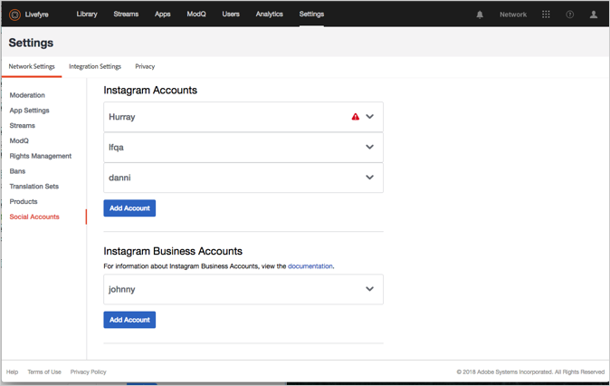
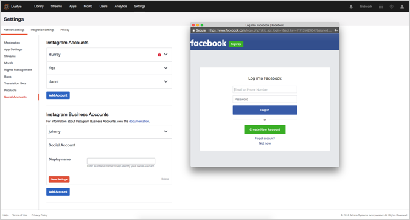

# Add a Social Account{#add-a-social-account}

配置社交帐户以在流或社交搜索中请求权限或搜索UGC。

Livefyre使用Twitter和Instagram社交帐户执行社交搜索（在库中）或使用流。

您必须在Twitter中配置帐户，才能在库中使用Twitter社交搜索。

Instagram的社交帐户规则不同，具体取决于您使用Adobe Livefyre的方式。 有关可与Livefyre一起使用的社交帐户类型的信息，请参阅关于 [Instagram帐户](/help/using/c-users-creating-accounts-with-studio-access/t-configure-social-accout-instagram/c-about-instagram-accounts.md#c_about_instagram_accounts)。

配置社交帐户：

1. 导航到 **[!UICONTROL Settings >]****[!UICONTROL Network Settings.]**
1. 导航到下 **[!UICONTROL Social Accounts]** 面的部分 **[!UICONTROL Network Settings]**。
1. 单击 **[!UICONTROL Add Account]** 要添加的社交帐户类型下的。 弹出一个对话框，允许您对Livefyre帐户进行授权。

   

   >[!NOTE]
   >
   >当您配置Instagram商业帐户时，您会转到Facebook登录屏幕。 继续正常登录。  &gt;

1. Click **[!UICONTROL Authorize App]** to continue.
1. 为帐 **[!UICONTROL Display Name]** 户添加一个，然后单击 **[!UICONTROL Save Settings.]**。 单击帐 **[!UICONTROL Social Account]** 户信息框标题中的可折叠帐户。
