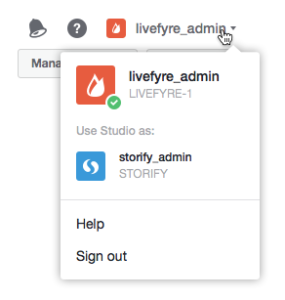

# 用户切换网络{#users-switching-networks}

您可以从单个Studio帐户管理多个网络。

>[!NOTE]
>
>这不常见。

**[!UICONTROL Account]** 下拉菜单列出与您当前登录的Studio帐户关联的所有用户名以及与其关联的网络。使用此下拉列表选择您希望管理的网络。

>[!NOTE]
>
>虽然大多数用户仅对单个网络具有权限，但某些Studio用户可以拥有或主持多个站点。Studio帐户允许他们使用单一用户名和口令登录，然后在多个站点访问级别之间进行切换。

