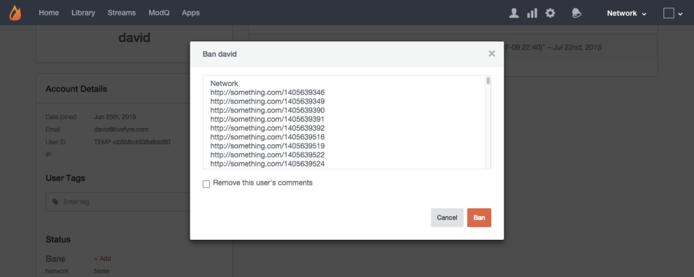

# 禁止用户{#ban-a-user}

您可以禁止Livefyre应用程序中的内联用户，而通过Livefyre登录的用户可能会从Studio的“库”&gt;“应用程序内容”页面中被禁止。

要从“用户”页面禁止用户，请执行以下操作：

1. 单 **[!UICONTROL +Add]** 击 **[!UICONTROL Bans]**。
1. 随后将显示一个弹出窗口，允许您禁止用户访问整个网络或特定站点。 （使用CTR或Command键选择多个站点。）
1. 单 **[!UICONTROL Remove this user’s comments]** 击可禁止用户Bozo发布任何以前的帖子，并将其从流中删除。 将此框保留为未选中状态，仅允许被禁用用户将来发布的帖子发送给Bozo。
1. 单击 **[!UICONTROL Ban]** 以完成该过程。
