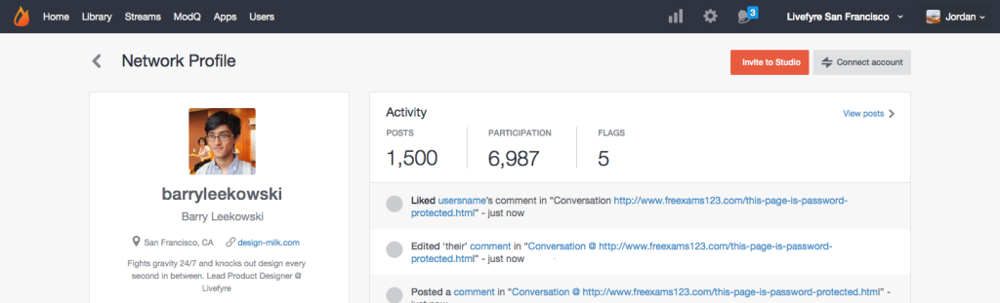

# 关联用户帐户{#link-user-accounts}

将您的Studio帐户关联到您的Livefyre帐户，以便从一个位置审核或管理您的所有Livefyre站点或网络。

>[!NOTE]
>
>要与Livefyre应用程序交互（例如，保留注释、添加Sitexear或共享内容），您必须使用Livefyre帐户用户名和密码登录，而不要使用Studio帐户用户名和密码。

要关联帐户：

1. 在网络上创建Livefyre用户配置文件后，登录到Studio。
1. 转到，查 **[!UICONTROL Users]**&#x200B;找您的用户配置文件，然后双击以查看详细信息。
1. 单击 **[!UICONTROL Connect account]**.
1. 在打开的窗口中，选择要链接到此帐户的用户帐户。
1. 确认信 **[!UICONTROL Link Profile]** 息，然后单击 **[!UICONTROL Link]**。 

