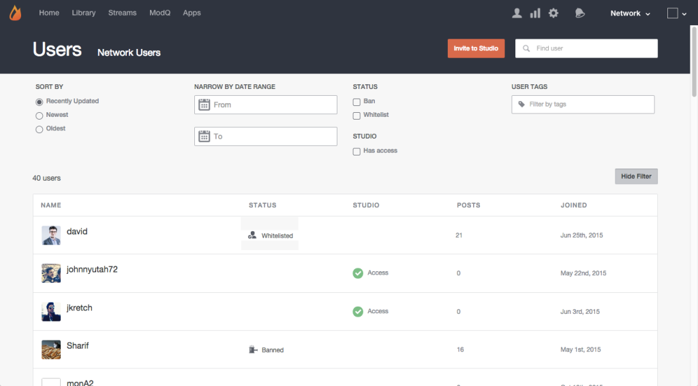

# 搜索用户{#search-for-users}

使用页面顶部的“搜索”字段可按显示名称、用户ID、电子邮件地址或他们加入Livefyre网络之日来搜索站点访客。

>[!NOTE]
>
>这些字段支持通配符搜索。

1. 单击 **[!UICONTROL Show Filter]** 以打开可筛选列出的用户的面板。
1. **[!UICONTROL Sort by]** 对列出的用户帐户的更新：最近更新、最新或最旧。
1. **[!UICONTROL Narrow by Date Range]** 仅列出在输入范围内添加的用户帐户。
1. 仅限列表 **[!UICONTROL Banned]** 或 **[!UICONTROL Whitelisted]** 用户。
1. 仅列出 **[!UICONTROL Studio]** 用户。
1. 仅列出附加了输入 **[!UICONTROL User Tags]** 的帐户。 

